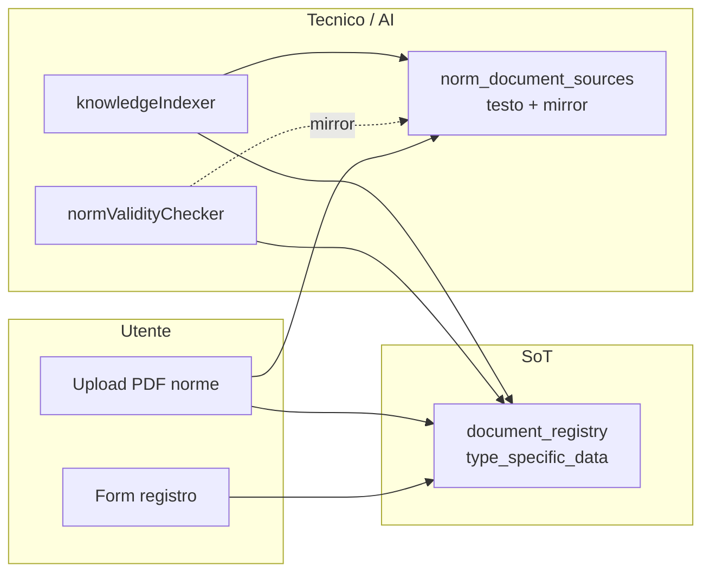

# ADR-011 — Registro documentale come SoT metadati norma

> **Stato**: Accettato — 25 maggio 2026  
> **Autori**: Lead architect (AI), Product owner  
> **Estende**: [ADR-009](ADR-009-multi-standard-architettura-per-norma.md), [ADR-010](ADR-010-ai-agentic-architecture.md)  
> **Piano implementativo**: [PLAN_REGISTRY_NORM_SOT_SLICES.md](../agent-tasks/PLAN_REGISTRY_NORM_SOT_SLICES.md) (slice R1–R7)

---

## Contesto

Prima del refactor R1–R7 (maggio 2026) i metadati normativi (codice, vigore, ente, anno) erano duplicati tra:

- `document_registry` — inventario visibile all’utente nel Registro Documentale
- `norm_document_sources` — tabella tecnica creata con l’upload PDF (migration 060) per testo estratto e chunk AI

Conseguenze:

| Problema | Impatto |
|---------|---------|
| Job validità leggeva solo `norm_document_sources` | Norme inserite a mano nel registro non venivano controllate |
| UI e knowledge index leggevano tabelle diverse | Stato vigore incoerente tra lista, scheda e assistente |
| Upload bulk e form manuale usavano schemi JSON diversi | Due percorsi, due verità |

---

## Decisione

### 1. Source of Truth (SoT) — metadati inventario norma

**`document_registry.type_specific_data`** (con `doc_type = 'norma'`) è l’**unica fonte di certezza** per i metadati normativi gestiti dall’utente:

| Campo JSON | Descrizione |
|-----------|-------------|
| `standard_code` | Codice norma (obbligatorio per job validità) |
| `norm_title` | Titolo norma |
| `issuing_body` | Ente emittente (UNI, ISO, IT, UE, …) |
| `edition_year` | Anno edizione |
| `supersedes` | Norma sostituita |
| `validity_status` | `vigente` \| `superata` \| `annullata` \| `in_revisione` |
| `last_validity_check` | Timestamp ultimo controllo catalogo |
| `validity_check_url` | URL fonte verifica (Normattiva, EUR-Lex, …) |
| `superseded_by` | Codice norma sostitutiva |
| `language`, `scope_summary`, `ics_code`, `technical_committee`, `is_harmonized` | Metadati descrittivi |

Schema canonico centralizzato in `documentRegistryNorm.service.js` — stesso contratto per form manuale, upload bulk (R3), job validità (R1), lookup form (R2).

### 2. Ruolo di `norm_document_sources` — mirror legacy / estensione AI

**`norm_document_sources`** resta **solo** per:

1. **Testo estratto** da PDF (`extracted_text`, `text_quality`) e **chunking RAG**
2. **Mirror transitorio** dei campi vigore scritti dal job (retrocompatibilità fino a deprecazione completa del mirror)
3. **FK obbligatoria** `document_id` ? riga registro esistente

**Non** è un secondo inventario. **Vietato**:

- Creare righe in `norm_document_sources` senza corrispondente `document_registry`
- Scrivere metadati norma **solo** su `norm_document_sources` senza aggiornare `type_specific_data`
- Usare `norm_document_sources` come SoT per UI, job validità o filtri catalogo

### 3. Flusso dati target

### 4. Backfill dati storici (R6)

Script una tantum `backend/scripts/backfill-norm-type-specific-data-vps.js`:

- Itera `norm_document_sources` con `document_id` valido
- Merge idempotente in `type_specific_data` (solo campi mancanti)
- **Non** crea righe inverse (registro con codice ma senza PDF ? nessuna riga AI vuota)

---

## Stato implementazione (R1–R7)

| Slice | Stato | Descrizione |
|-------|-------|-------------|
| R1 | Completata | Job validità legge `document_registry` |
| R2 | Completata | Lookup e PATCH persistono vigore su registro |
| R3 | Completata | Upload bulk stesso schema `type_specific_data` |
| R4 | Completata | Badge vigore in UI da registro |
| R5 | Completata | Knowledge index ancorato al registro |
| R6 | Completata | Backfill VPS dati legacy |
| R7 | Completata | Questo ADR |

---

## Conseguenze

### Positive

- Un solo contratto JSON per norme in tutto lo stack
- Norme manuali coperte da job validità e UI
- Assistente AI con metadati tracciabili anche senza PDF indicizzato

### Negative / debito residuo

- Mirror su `norm_document_sources` duplica ancora vigore fino a rimozione esplicita (post-R5 stabilizzazione)
- Righe storiche senza `standard_code` in entrambe le tabelle restano fuori dal job

### Regole per nuove feature

1. Leggere metadati norma sempre da `document_registry.type_specific_data`
2. Scrivere vigore sempre sul registro; mirror opzionale su `norm_document_sources`
3. Chunk/testo solo da `norm_document_sources.extracted_text`
4. Usare `documentRegistryNorm.service.js` per build/merge/serialize

---

## Riferimenti

- [GUIDA_CONSOLIDATA.md](../GUIDA_CONSOLIDATA.md) — sezione *Verifica validità norme*
- `backend/src/services/documentRegistryNorm.service.js`
- `backend/src/services/normValidityChecker.service.js`
- `backend/scripts/backfill-norm-type-specific-data-vps.js`
