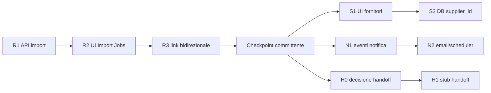

# TASK — Estensioni Riesame Requisiti (slice verticali)

**Stato:** IN CORSO — slice **S2** (supplier_id)  
**Slice S1:** ✅ PR aperta — UI counterparty tab Documenti  
**Slice R3:** ✅ TEST OK — PR [#83](https://github.com/qsstudio241/sistema-gestione-iso9001/pull/83) + hotfix [#84](https://github.com/qsstudio241/sistema-gestione-iso9001/pull/84)  
**Slice R2:** ✅ TEST OK — PR [#81](https://github.com/qsstudio241/sistema-gestione-iso9001/pull/81) + hotfix DB [#82](https://github.com/qsstudio241/sistema-gestione-iso9001/pull/82)  
**Creato:** 02/06/2026  
**Baseline completata:** PR [#79](https://github.com/qsstudio241/sistema-gestione-iso9001/pull/79) — pilota ordine diretto operativo  
**Spec di riferimento:** [MINI_SPEC_RIESAME_REQUISITI_CONTRATTO.md](../specs/MINI_SPEC_RIESAME_REQUISITI_CONTRATTO.md)

---

## Comando da incollare in nuova chat (Cursor locale o cloud)

```
Leggi in ordine:
1) docs/agent-tasks/TASK_RIESAME_ESTENSIONI_SLICES.md
2) docs/specs/MINI_SPEC_RIESAME_REQUISITI_CONTRATTO.md
3) docs/GUIDA_CONSOLIDATA.md (sezione sessione 02/06/2026)

Esegui la SLICE indicata sotto (parti da R2 se non specificato).
Una slice alla volta: implementa → test L1 → checkpoint → commit/PR → attendi OK committente prima della slice successiva.
Chiudi ogni slice con TEST OK o elenco FIX residui.
```

**Slice corrente consigliata:** `S2` (supplier_id anagrafica)

---

## Cosa è già fatto (non rifare)

| Area | Stato |
|------|--------|
| CRUD `commercial_cases`, history, checklist | ✅ |
| Workflow gate + 409 `TRANSITION_BLOCKED` | ✅ |
| UI slide (Workflow / Checklist / Chiarimenti / Documenti / Analisi AI) | ✅ |
| Inbox + summary | ✅ |
| Migrazione 068 (clarifications, documents, allegati commercial_*) | ✅ VPS |
| Import job Sprint 9–10 → **solo** `commit-to-registry` | ✅ separato |
| **R1** `POST /contract-reviews/import-from-job` | ✅ PR [#80](https://github.com/qsstudio241/sistema-gestione-iso9001/pull/80) merge `5403b1c` |
| **R2** UI Import Jobs «Crea caso Riesame» | ✅ PR [#81](https://github.com/qsstudio241/sistema-gestione-iso9001/pull/81) + DB [#82](https://github.com/qsstudio241/sistema-gestione-iso9001/pull/82) migrazione 069 |

---

## Ordine consigliato e parallelismo



| Epic | Dipende da | Parallelizzabile con |
|------|------------|----------------------|
| **R** import-from-job | — | N1 (solo design/doc) |
| **S** fornitori | R3 (consigliato) | N1 |
| **N** notifiche | R3 (consigliato) | S1 (dopo R3) |
| **H** handoff commessa | **H0 decisione committente** | nulla finché H0 non deciso |

**Regola multitask:** massimo **1 slice in implementazione** per sessione agente; al massimo **1 slice in design** in parallelo (es. N1 mentre R1 è in review).

---

## Regole trasversali (ogni slice)

1. **Branch:** `cursor/riesame-<slice-id>-<suffix>` (es. `cursor/riesame-r1-import-job-5351`)
2. **PR draft** subito dopo primo push; CI app deve essere verde
3. **Test L1 obbligatori:**
   - Backend: `npm test -- --testPathPattern=contractReview|importJob`
   - Frontend: `NODE_ENV=test npm test -- --run` (file mirati se possibile)
   - Build: `npm run build` in `app/`
4. **Deploy backend** se tocchi controller/routes/service: pattern VPS in `GUIDA_CONSOLIDATA.md` (scp + restart + verifica PID)
5. **Migrazioni DB:** numero progressivo **069+**; script `run-migration-069-vps.js`; batch `GO` se indici su colonne nuove
6. **Multi-tenant:** sempre `organization_id` in query
7. **Commit umano import:** mai creazione caso automatica senza conferma UI (golden rule spec §6)
8. **Checkpoint committente:** dopo ogni slice, smoke L3 breve (2–5 min) prima di slice successiva

---

# EPIC R — Import-from-job

**Obiettivo:** da un Import Job PDF (testo/AI già estratto) creare un **caso Riesame** in bozza, con allegati collegati, dopo conferma utente.

**File esistenti da estendere (non duplicare):**
- `backend/src/controllers/importJobs.controller.js` — pattern `commitToRegistry`
- `backend/src/controllers/contractReview.controller.js` — `createCase`, allegati
- `app/src/pages/ImportJobsPage.jsx` — già ha commit registro
- `app/src/services/apiService.js`

### Slice R1 — Backend API (solo server, test Jest)

| # | Task | Dettaglio |
|---|------|-----------|
| R1.1 | Endpoint | `POST /api/v1/contract-reviews/import-from-job` **oppure** `POST /import-jobs/:id/create-contract-case` (scegliere uno, documentare in BACKEND_API) |
| R1.2 | Body | `{ job_id, file_ids?: number[], title?, company_id?, external_ref?, notes? }` — `company_id` default da job se presente |
| R1.3 | Validazioni | Job org-scoped; file in stato `extracted` o `reviewed`; 409 se già linkato a caso |
| R1.4 | Creazione caso | `commercial_cases` status `DRAFT`; genera checklist preliminare (riusa `generateChecklist`) |
| R1.5 | Allegati | Copia/link file job → `attachments.commercial_case_id` + metadata `direction=in`, `counterparty=customer`, `commercial_doc_role=rfq` (o da AI guess) |
| R1.6 | Opzionale AI | Prefill `notes` con estratto testo (troncato) — **non** auto-compilare checklist |
| R1.7 | Test Jest | Happy path, job altra org 404, file già usato 409, job senza file 400 |

**Checkpoint R1 (agente):**
- [x] Jest verde
- [x] Health API OK post-deploy VPS
- [ ] `curl` autenticato crea caso e ritorna `{ case_id, uuid }` (opzionale committente)

**Checkpoint R1 (committente — 3 min):**
- [ ] Con Postman/curl o script: un job reale produce un caso visibile in lista ( anche solo via API )

---

### Slice R2 — UI Import Jobs

| # | Task | Dettaglio |
|---|------|-----------|
| R2.1 | Pulsante | In `ImportJobsPage.jsx`, per file `extracted`/`reviewed`: **«Crea caso Riesame»** |
| R2.2 | Modale conferma | Mostra titolo proposto, cliente, anteprima testo (prime righe); campi editabili prima del submit |
| R2.3 | apiService | Metodo `importContractCaseFromJob(jobId, payload)` |
| R2.4 | Successo | Redirect a `/contract-reviews/:id` tab Documenti o Workflow |
| R2.5 | Errori | Messaggi 409/400 user-friendly (già usato, file non pronto) |

**Checkpoint R2 (committente):**
- [x] Import PDF → estrai → **Crea caso Riesame** → caso aperto con allegato visibile (smoke Playwright 02/06/2026, caso #5)
- [x] Hard refresh: dati persistono

---

### Slice R3 — Link bidirezionale (tracciabilità)

| # | Task | Dettaglio |
|---|------|-----------|
| R3.1 | Migrazione **070** | Colonne: `commercial_cases.source_import_job_id INT NULL`; `import_job_files.commercial_case_id INT NULL` (FK separate, no ON DELETE CASCADE) |
| R3.2 | UI caso | Badge «Origine: Import job #N» con link a pagina import |
| R3.3 | UI job | Badge «Caso Riesame #N» se già creato; disabilita doppio create |
| R3.4 | Idempotenza | Secondo click → 409 con link caso esistente |

**Checkpoint R3 (committente):**
- [x] Stesso file non crea due casi (409 ALREADY_LINKED — smoke 02/06/2026)
- [x] Navigazione job ↔ caso funziona (badge bidirezionale + deep-link — smoke 14/14)

**Definition of Done Epic R:** flusso PDF → caso Riesame senza passare dal registro documenti (opzionale commit registro resta separato).

---

# EPIC S — Fornitori (fase 2 spec)

**Obiettivo:** documenti/allegati **da/per fornitore** nel contesto caso, con UI chiara.

**Nota:** backend accetta già `counterparty: supplier` su link documenti/allegati; manca UX e anagrafica.

### Slice S1 — UI counterparty (senza migrazione)

| # | Task | Dettaglio |
|---|------|-----------|
| S1.1 | Tab Documenti | Select «Controparte»: Cliente / Fornitore / Interno |
| S1.2 | Tab Documenti | Select «Direzione»: In entrata / In uscita |
| S1.3 | Upload allegati | Stessi campi in form upload (default customer/in) |
| S1.4 | Lista | Badge visivo per riga (es. «Fornitore · in») |

**Checkpoint S1:** committente carica PDF da fornitore con metadata corretti.

**Checkpoint S1 (agente):**
- [x] Select controparte/direzione su collega registro e upload
- [x] Badge per riga documenti/allegati
- [x] Test L1 + build OK
- [ ] Smoke L3 breve post-deploy Netlify (committente)

---

### Slice S2 — Collegamento anagrafica fornitore (se tabella suppliers esiste)

| # | Task | Dettaglio |
|---|------|-----------|
| S2.1 | Verifica schema | Tabella `suppliers` o equivalente in `DATABASE_SCHEMA.md` |
| S2.2 | Migrazione **071** | `commercial_case_documents.supplier_id INT NULL` (+ index) |
| S2.3 | UI | Dropdown fornitore quando counterparty=supplier (opzionale) |
| S2.4 | Checklist P9 | Evidenziare voce «Subforniture» se esistono doc supplier |

**Checkpoint S2:** documento linkato a fornitore anagrafico.

**Definition of Done Epic S:** percorso sub-fornitura documentabile nel caso (minimo pilota).

---

# EPIC N — Notifiche approvazioni

**Obiettivo:** avvisare quando un caso richiede azione (approvazione offerta, assegnazione), senza dipendere solo dall’inbox in-app.

**File da riusare:** `backend/src/services/alertMail.service.js`, `alertScheduler.js`

### Slice N1 — Modello eventi (backend)

| # | Task | Dettaglio |
|---|------|-----------|
| N1.1 | Eventi | `commercial_case.pending_approval` (stati QUOTE_APPROVAL, FINAL_REVIEW→APPROVED) |
| N1.2 | Eventi | `commercial_case.assigned` (cambio `current_assignee_id`) |
| N1.3 | Persistenza | Tabella leggera `commercial_case_notifications` o riuso pattern alert esistente |
| N1.4 | Preferenze | Rispettare opt-out org se già previsto per altri moduli |

**Checkpoint N1:** transizione a QUOTE_APPROVAL genera record notifica in DB.

---

### Slice N2 — Email / digest

| # | Task | Dettaglio |
|---|------|-----------|
| N2.1 | Template email | Oggetto + link diretto `/contract-reviews/:id` |
| N2.2 | Scheduler | Job giornaliero o trigger su transizione (scegliere minimo robusto) |
| N2.3 | In-app | Badge contatore su voce menu «Riesame Requisiti» (opzionale se email ok) |

**Checkpoint N2 (committente):**
- [ ] Email ricevuta (o log mail server in dev)
- [ ] Link apre caso corretto

**Definition of Done Epic N:** almeno **email su approvazione in sospeso** funzionante in produzione.

---

# EPIC H — Handoff commessa

**Obiettivo:** dopo `APPROVED`, registrare passaggio a esecuzione/commessa.

**⚠️ BLOCKER H0 — decisione committente obbligatoria prima di codice:**

Scegliere **una** opzione:

| Opzione | Descrizione | Complessità |
|---------|-------------|-------------|
| **H-A (consigliata pilota)** | Campo testo `handoff_ref` + flag `handoff_at` / `handoff_by` — nessun modulo commesse | Bassa |
| **H-B** | Link a record esterno (numero commessa ERP) | Media |
| **H-C** | Nuovo modulo «Commesse» nel SGQ | Alta — fuori scope immediato |

### Slice H1 — Stub handoff (dopo decisione H-A o H-B)

| # | Task | Dettaglio |
|---|------|-----------|
| H1.1 | Migrazione 071 | `commercial_cases.handoff_ref NVARCHAR(100)`, `handoff_at`, `handoff_by` |
| H1.2 | API | `POST /contract-reviews/:id/handoff` body `{ handoff_ref, notes? }` — solo se status=APPROVED |
| H1.3 | UI | Tab Workflow: sezione «Passaggio a esecuzione» + storico |
| H1.4 | Gate | Opzionale: bloccare nuove transizioni dopo handoff |

**Checkpoint H1:** caso APPROVED → registra riferimento commessa → visibile in dettaglio.

**Definition of Done Epic H:** tracciabilità ISO del passaggio commerciale → esecuzione ( anche solo riferimento esterno ).

---

## Matrice checkpoint (riepilogo)

| Slice | L1 auto | Deploy VPS | Smoke committente |
|-------|---------|------------|-------------------|
| R1 | Jest import + contractReview | Sì | curl/API |
| R2 | Vitest + build | No* | UI Import → Caso |
| R3 | Jest + migrazione 069 | Sì | Idempotenza |
| S1 | build | No | Upload fornitore |
| S2 | Jest + migrazione 070 | Sì | Link fornitore |
| N1 | Jest | Sì | Query DB |
| N2 | Jest + build | Sì | Email ricevuta |
| H1 | Jest + migrazione 071 | Sì | Handoff registrato |

\*Netlify deploy automatico su merge `main`.

---

## Rischi e mitigazioni

| Rischio | Mitigazione |
|---------|-------------|
| Duplicazione casi da stesso PDF | R3 idempotenza + unique su `import_job_files.commercial_case_id` |
| Import automatico senza revisione | Modale conferma obbligatoria (R2) |
| SQL Server Evaluation scaduta | Monitorare health; doc recovery in GUIDA 02/06 |
| Handoff senza modulo commesse | Opzione H-A stub — non bloccare R/S/N |
| Email spam | Notificare solo transizioni critiche; digest giornaliero opzionale |

---

## Aggiornamento doc a fine di ogni epic

- `docs/reference/BACKEND_API.md` — nuovi endpoint
- `docs/GUIDA_CONSOLIDATA.md` — lezione appresa + PR mergiata
- `docs/PROJECT_ROADMAP.md` — segna epic completata
- `docs/agent-tasks/DEPUTYTASK.md` — slice corrente / CHIUSO

---

## Stato avanzamento (aggiornare a ogni slice)

| Slice | Stato | PR | Note |
|-------|--------|-----|------|
| R1 | ✅ TEST OK | #81 | import-from-job |
| R2 | ✅ TEST OK | #81 | UI Import Jobs |
| R3 | ✅ TEST OK | #83/#84 | link bidirezionale |
| S1 | ✅ TEST OK | #85 | counterparty UI |
| S2 | ✅ TEST OK | #86 | supplier_id mig. 073 |
| N1 | ✅ TEST OK | #87 | notifiche DB |
| N2 | ✅ TEST OK | #87 | email immediata |
| H0 | ✅ H-A | — | stub handoff |
| H1 | ✅ TEST OK | #88 | handoff mig. 075 |

**Legenda:** ⬜ TODO · 🔄 IN CORSO · ✅ TEST OK · ❌ BLOCCATO
