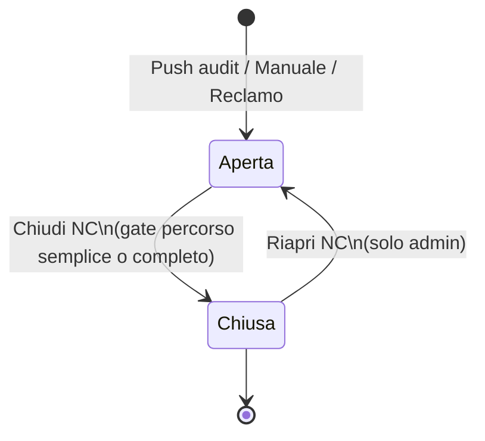

# Manuale utente — Modulo Non Conformità (NC)

> **Versione:** 30/05/2026 · **Ambiente di riferimento:** https://systemgest.netlify.app/nc  
> **Commit produzione:** `ac9b1a8` (NC Hardening H1–H6) · **Simulazione browser:** 30/05/2026 (org Al.project, utente PS_Admin)

---

## Nota sullo stato funzionale

| Area | Stato in produzione (`ac9b1a8`) |
|------|----------------------------------|
| Griglia registro, filtri, stats | **Sì** |
| Creazione manuale, push ISO da audit | **Sì** |
| Workflow stati + gate note verifica | **Sì** |
| Azioni correttive per NC | **Sì** |
| Allegati evidenze su NC | **Sì** |
| Link audit → NC, deep-link `?select=` | **Sì** |
| NC da reclamo | **Sì** |
| Filtri scadenze NC (scadute / 7 gg) | **Sì** |
| Push checklist **custom** → registro NC | **Sì** (H1, migrazione 072) |
| Approvazione RQ prima della chiusura | **Sì** (H3) |
| Export CSV registro | **Sì** (H5) |
| Vista «Azioni in scadenza» cross-NC | **Sì** (H6) |
| Sezioni ISO dinamiche in modale manuale | **Sì** (H4) |
| Email alert scadenze NC | **Sì** (job backend + rubrica referenti); attivare `NC_ALERT_ENABLED` + SMTP sul VPS se non già configurato |
| Rubrica referenti NC (migrazioni 073/074) | **Sì** — selezione responsabili da rubrica + escalation verso referenti |

Baseline documentata: chiusura **NC Fase 1** + hardening **H1–H6** (`ac9b1a8`), migrazione **072** su VPS. Dettaglio tecnico in `docs/GUIDA_CONSOLIDATA.md` (sezione NC Hardening).

---

## 1. Introduzione

### Cos'è il modulo NC

Il modulo **Non Conformità & Azioni Correttive** (`/nc`) è il registro organizzativo dello studio QS: raccoglie in un unico elenco tutte le NC e le osservazioni (OSS) emerse da audit ISO, da inserimenti manuali o da reclami, e permette di gestire il ciclo di vita fino alla verifica di efficacia (ISO 9001 §10.2).

### Chi lo usa

| Ruolo | Uso tipico |
|-------|------------|
| **Responsabile Qualità (RQ) / admin** | Panoramica multi-cliente, approvazioni chiusura, export CSV |
| **Auditor / consulente** | Push da audit, compilazione cause, azioni, evidenze |
| **Viewer** | Consultazione (se abilitato dal tenant) |

Richiede licenza modulo **`nc`** (voce menu «Non Conformità», icona sirena rossa). Senza licenza compare la schermata modulo bloccato.

---

## 2. Accesso e permessi

### Come accedere

1. Accedere a https://systemgest.netlify.app con le proprie credenziali.
2. Nel menu laterale SGQ, cliccare **Non Conformità** (icona sirena rossa).
3. Si apre la pagina **Non Conformità & Azioni Correttive** con sottotitolo *ISO 9001:2015 §8.7 + §10.2 - Registro cross-audit*.

### Studio vs cliente

- Il registro è **cross-audit**: una riga per ogni NC, con colonna **Cliente** e filtro **Tutti i clienti**.
- Gli **auditor** vedono le NC nel perimetro del proprio studio (`auditor_org_id`); **admin/superadmin** vedono l'intero tenant.
- Le NC restano collegate all'**audit di riferimento** (numero audit cliccabile nel dettaglio).

### Permessi operativi (sintesi)

| Azione | Admin / superadmin | Auditor | Viewer |
|--------|-------------------|---------|--------|
| Consultare registro | **Sì** | **Sì** (perimetro studio) | **Sì** (lettura) |
| Creare NC manuale | **Sì** | **Sì** | **No** |
| Modificare NC aperta | **Sì** | **Sì** | **No** |
| Workflow stati | **Sì** | **Sì** | **No** |
| Push da audit (chiusura) | **Sì** | **Sì** | **No** |
| Allegati evidenze | **Sì** | **Sì** | **No** |
| Approvazione chiusura RQ (H3) | **Sì** | **No** | **No** |
| Riapertura NC chiusa | **Sì** | **No** | **No** |
| Export CSV registro | **Sì** | **Sì** | **No** |

---

## 3. Scenari operativi

### 3.1 Panoramica RQ — registro multi-cliente

**Chi:** Responsabile Qualità, admin studio.

**Quando:** Controllo periodico del registro NC, preparazione audit di sorveglianza o riesame direzione.

**Passi**

1. Aprire `/nc`.
2. Osservare le **card riepilogo** cliccabili: **Aperte**, **Scadute**, **In scadenza** (se presenti), **Totale**. Un clic applica il filtro corrispondente; un secondo clic lo rimuove.
3. Usare il menu **Tutti i clienti** per restringere a un'azienda (es. *Azienda Test Fase 1*).
4. Cercare per testo nel campo **Cerca per numero NC o descrizione...**.
5. Affinare con **Tutti gli stati**, **Tutte le severità**, **Tutte le scadenze** (Solo scadute / In scadenza 7 gg).
6. Cliccare una riga della griglia per aprire il **pannello laterale** (drawer a destra). La griglia resta visibile; chiudere con **✕** o clic fuori dal pannello. L'URL diventa `/nc?select=<id>`. Su schermo desktop potete **allargare il pannello** trascinando la maniglia sul bordo sinistro (larghezza minima 520 px, massima 900 px o 90% finestra; la preferenza viene ricordata).

**Ordine sezioni nel drawer** (flusso semplificato Aperta/Chiusa; biforcazione su necessità azione correttiva):

| # | Sezione | Contenuto |
|---|---------|-----------|
| 1 | **Scheda NC** | Severità, responsabile NC, scadenza; badge origine (audit/reclamo/manuale) |
| 2 | **Difetto/Problema** | Descrizione della non conformità riscontrata |
| 3 | **Valutazione azione correttiva** | Sì/No + motivazione (ISO §10.2.1b) — decide il percorso |
| 4 | **Trattamento** | Correzione immediata (ISO §10.2.1a) — sempre obbligatoria |
| 5 | **Cause** | Solo se AC necessaria — analisi causa radice |
| 6 | **Azioni correttive / preventive** | Solo se AC necessaria (ISO §10.2.1c) |
| 5/7 | **Evidenze** | Allegati facoltativi |
| 6/8 | **Verifica** | Note + **Responsabile verifica** selezionato dal menu (funzione RQ) |
| 7/9 | **Chiusura** | **Chiudi NC** (solo se gate OK); **Riapri NC** (solo admin, se chiusa) |
| — | **Salva modifiche** | In fondo al drawer — necessario per abilitare Chiudi |

**Domande che mi pongo (FAQ interne)**

- *Vedo tutte le NC dello studio o solo quelle di un cliente?*  
- *Come capisco quali NC sono urgenti?*

**Risposte**

- Con filtro cliente vuoto vedete tutte le NC del vostro perimetro RBAC; con un cliente selezionato solo quelle collegate ad audit di quell'azienda.
- Le NC con scadenza superata mostrano evidenziazione sulla colonna N° NC e la card **Scadute** si aggiorna. Usate i filtri scadenza per liste di controllo.

**Screenshot note**

- In alto: titolo con sirena, pulsante blu **+ Nuova NC**, pulsanti **Export CSV** e **Azioni in scadenza**, card colorate (rosso/giallo per aperte/in corso).
- Griglia colonne: **N° NC**, **Stato** (pallino colorato), **Severità** (etichetta colorata), **Cliente**, **Audit** (icona documento), **Scadenza**, **Origine** (Manuale / Audit NC / Audit OSS / Reclamo).

---

### 3.2 NC da push audit ISO (NC e OSS)

**Chi:** Auditor al termine o durante la compilazione audit ISO 9001.

**Quando:** L'audit ha risposte **NC** (non conforme) o **OSS** (osservazione) nella checklist ISO e si vuole gestirle nel registro organizzativo.

**Passi**

1. Aprire l'audit da **Audit** → selezionare l'audit in corso.
2. Compilare la checklist segnando esiti **NC** o **OSS** sulle domande pertinenti (pulsanti esito rosso/giallo della checklist).
3. Andare al pannello **Chiusura audit** (tab o sezione chiusura).
4. Se è presente il blocco **Trasferimento al modulo Non Conformità** con conteggio NC/OSS, cliccare **Trasferisci NC e OSS al modulo NC**.
5. Attendere il messaggio di conferma; entro **10 secondi** è possibile **Annulla trasferimento** se il push era errato.
6. Cliccare il link **modulo NC** o aprire `/nc`: le nuove righe hanno origine **Audit NC** o **Audit OSS** e numero tipo `NC-<audit>-00n`.

**Domande che mi pongo**

- *Posso ripetere il push?*  
- *Cosa succede alle note della domanda?*

**Risposte**

- Il push è **idempotente**: le NC già presenti per la stessa domanda vengono saltate (messaggio «già presenti»).
- Descrizione e riferimento sezione ISO vengono copiati dalla risposta audit; potete arricchirli nel dettaglio NC.

**Screenshot note**

- Pannello chiusura: box «Rilevate X NC e Y OSS» con pulsante verde secondario.
- In registro: origine **Audit OSS** con severità **Osservazione** (viola) o **Audit NC** con severità tipicamente **Lieve/Grave**.

---

### 3.3 NC da push checklist custom

**Chi:** Auditor su audit con checklist personalizzata.

**Quando:** Item custom con esito NC/OSS devono entrare nel registro come per la checklist ISO.

**Passi**

1. Compilare item custom con esito NC o OSS.
2. Dalla chiusura audit, usare lo stesso flusso **Trasferisci NC e OSS al modulo NC** (il backend include anche `audit_custom_checklist_responses`).
3. Verificare in `/nc` le righe con origine da audit e tracciabilità item custom (migrazione **072**, `source_custom_item_id`).
4. Nel riepilogo push, controllare i conteggi **ISO** e **custom** se mostrati nel pannello chiusura.

**Domande / Risposte**

- *Perché una NC custom non compare?* — Verificare esito NC/OSS sull'item, ripetere push (idempotente) o creare NC manuale collegata allo stesso audit come integrazione.

---

### 3.4 NC manuale

**Chi:** RQ, auditor, admin.

**Quando:** Rilievo fuori checklist, NC da verbalizzazione cartacea, integrazione registro senza passare dall'audit.

**Passi**

1. In `/nc`, cliccare **+ Nuova NC**.
2. Nel modale **Nuova NC manuale**, selezionare **Audit di riferimento** (obbligatorio — dropdown con audit aperti o, se assenti, tutti gli audit).
3. Scegliere **Sezione ISO** (clausole 4–10 HLS caricate dinamicamente in base allo standard dell'audit — H4).
4. Impostare **Severità** (Grave / Lieve / Osservazione).
5. Compilare **Descrizione** (obbligatoria).
6. Opzionale: **Responsabile NC**, **Scadenza NC**.
7. Cliccare **Crea NC**. La riga appare con origine **Manuale** e numero prefisso `NC-M-...`.

**Domande che mi pongo**

- *Perché il dropdown audit è vuoto?*  
- *Errore «Sezione non valida»?*

**Risposte**

- Se non ci sono audit «aperti», il sistema elenca comunque gli audit disponibili (fix Fase 1). Verificare di avere audit nell'organizzazione.
- Se l'audit è ISO 14001/3834 e si sceglie una sezione HLS ISO 9001, l'API risponde **400** con codice `INVALID_SECTION_FOR_STANDARD`: scegliere un audit ISO 9001 o una sezione compatibile con lo `standard_id` dell'audit.

**Screenshot note**

- Modale centrato: campi impilati, pulsanti **Annulla** (bianco) e **Crea NC** (blu).

---

### 3.5 NC da reclamo (link origine)

**Chi:** RQ, addetto reclami.

**Quando:** Un reclamo cliente/fornitore deve generare una NC tracciata nel registro §10.2.

**Passi**

1. Aprire **Reclami** (`/reclami`).
2. Individuare il reclamo e usare l'azione **Promuovi a NC** (o equivalente nella riga).
3. Inserire l'**ID audit** di collegamento quando richiesto dal prompt.
4. Confermare: il sistema crea la NC con `source_type: complaint`.
5. Aprire `/nc`: la NC mostra badge **Reclamo** con link **Reclamo #…** che riporta a `/reclami?complaint=<id>`.

**Domande / Risposte**

- *Posso promuovere due volte lo stesso reclamo?* — No: se esiste già una NC collegata, compare messaggio «NC già esistente» con il numero NC.

**Screenshot note**

- Nel dettaglio NC: badge origine Reclamo + link cliccabile accanto al badge Manuale/Audit.

---

### 3.6 Workflow semplificato (Aperta / Chiusa)

**Chi:** Auditor (eleva e lavora la NC); **Responsabile verifica** (menu a tendina — funzione RQ) attesta la risoluzione e consente la chiusura.

**Quando:** Dalla apertura alla chiusura formale della NC secondo ISO 10.2.

**Stati NC**

`Aperta` → `Chiusa`

(Gli stati storici In corso / Risolta / Verificata restano a DB ma in elenco si mostrano come **Aperta**.)

**Biforcazione (obbligatoria)**

In sezione **3. Valutazione azione correttiva** scegliere:

| Scelta | Percorso | Sezioni aggiuntive | Gate per **Chiudi NC** |
|--------|----------|--------------------|------------------------|
| **No, non necessaria** | Semplice | Nascoste: Cause, Azioni correttive | Motivazione + trattamento completato + note verifica trattamento + **responsabile verifica selezionato** |
| **Sì, necessaria** | Completo | Cause + Azioni correttive/preventive | Causa radice + almeno 1 azione correttiva completata + trattamento + note verifica + **responsabile verifica selezionato** |

**Passi**

1. Selezionare la NC in griglia.
2. Compilare Scheda, Difetto/Problema, Valutazione AC, Trattamento (correzione immediata).
3. Se AC necessaria: Cause e Azioni correttive.
4. Evidenze (facoltative).
5. **Verifica**: note + **selezionare** il Responsabile verifica dal menu (nessuna assegnazione automatica).
6. **Salva modifiche** dopo ogni compilazione sostanziale.
7. Quando i gate sono soddisfatti compare **Chiudi NC** — un solo click (conferma). Non esiste più «Approva chiusura (RQ)» separata: la verifica con responsabile indicato è l'atto formale.
8. NC **Chiusa**: campi in sola lettura.
9. **Riapertura (solo admin/superadmin):** **Riapri NC** → torna **Aperta**; per richiudere servono di nuovo i gate sopra.

**Domande che mi pongo**

- *Perché non vedo Chiudi NC?*
- *Devo essere RQ per chiudere?*

**Risposte**

- Il pulsante compare solo se tutti i gate del percorso (semplice o completo) sono soddisfatti **e salvati**, incluso il responsabile verifica selezionato dal menu.
- Chi chiude può essere l'auditor che ha elevato la NC, **purché** sia (o abbia selezionato) il responsabile verifica indicato nel menu.

**Screenshot note**

- Pulsante **Chiudi NC** in sezione Chiusura solo quando i gate sono verdi.
- NC chiusa: intestazione «NC-… — Chiusa», campi grigio/readonly.

---

### 3.7 Correzione e azioni — attuazione, responsabile, scadenza

**Chi:** Referente processo, auditor, RQ.

**Quando:** Per ogni NC serve tracciare cosa si fa, chi lo fa, entro quando.

La norma ISO 9001 §10.2.1 distingue due concetti:

| Concetto | Punto norma | Obbligatorio? | Tipo azione nel sistema |
|---|---|---|---|
| **Correzione** (reazione immediata) | §10.2.1 a) | **Sì**, sempre | Immediata |
| **Azione correttiva** (eliminare la causa) | §10.2.1 b)-d) | Condizionata alla valutazione | Correttiva |
| **Azione preventiva** | — | Facoltativa | Preventiva |

**Passi**

1. Per la correzione immediata: nel drawer NC, sezione **3. Trattamento** → **+ Aggiungi correzione**. Il tipo è sempre **Immediata** (reazione ISO §10.2.1a), non richiede selezione.
2. Per le azioni correttive/preventive (dopo aver analizzato le cause in sez. 4): sezione **6. Azioni correttive / preventive** → **+ Aggiungi azione**, scegliendo **Tipo** (Correttiva / Preventiva).
3. Compilare **Descrizione***, **Responsabile attuazione**, **Scadenza**, poi **Salva**.
4. Per ogni azione, avanzare lo stato con i pulsanti: **Avvia** → **Completa**.
5. **Gate obbligatorio**: la NC non può passare a **Risolta** senza almeno una correzione (azione Immediata, sez. 3) completata. Se manca, il badge rosso «Obbligatoria» è visibile in sez. **3. Trattamento**.
6. Quando **tutte** le azioni sono Completate, la NC passa automaticamente a **Risolta**. Il giudizio sull'efficacia è **complessivo**: si compila una sola volta in **8. Verifica efficacia** (vedi §3.6).
7. Se ci sono azioni scadute o in scadenza entro 7 giorni, usare i filtri **Scadute** / **In scadenza 7 gg** sopra l'elenco in **6. Azioni correttive / preventive**.

**Valutazione necessità azione correttiva (§4 Cause)**

Nella sezione **4. Cause e valutazione** è presente il campo «È necessaria un'azione correttiva?» (Sì / No / Non valutato) con motivazione. Questo campo documenta la valutazione richiesta da ISO §10.2.1 b) ed è informativo (non bloccante).

*Nota retrocompatibilità: azioni create prima di questa modifica possono ancora mostrare lo stato storico «Verificata» con relativa nota — resta visibile ma non è più un passaggio richiesto per le nuove azioni.*

**Domande / Risposte**

- *Posso eliminare un'azione?* — Sì, solo se è ancora **Aperta** (pulsante Elimina).
- *La scadenza azione è quella della NC?* — No: sono indipendenti; la NC ha la sua scadenza nel form principale.
- *Perché non posso segnare la NC come Risolta?* — Verificare che esista almeno una azione di tipo Immediata (sez. 3. Trattamento) con stato Completata.

**Screenshot note**

- La **Correzione (ISO §10.2.1a)** è ora una sezione propria («3. Trattamento»), separata dalle **Azioni correttive / preventive** («6. Azioni correttive / preventive»), con badge tipo e stato su ogni azione.

---

### 3.8 Allegati evidenze

**Chi:** Auditor, RQ.

**Quando:** Documentare foto, PDF, registrazioni a supporto della NC o della verifica (facoltativi — mai bloccanti per la compilazione).

**Passi**

1. Nel drawer NC, sezione **7. Evidenze**.
2. Cliccare **Carica file** (o area upload) e selezionare uno o più file.
3. Attendere il completamento; l'elenco mostra nome e dimensione.
4. Per rimuovere: icona elimina → conferma (non disponibile se NC in sola lettura).

**Domande / Risposte**

- *Gli allegati sono obbligatori?* — No, per policy SGQ; bastano le note testuali per chiudere il workflow.

**Screenshot note**

- Blocco analogo agli allegati checklist: lista file sotto l'etichetta «Allegati evidenze».

---

### 3.9 Riapertura NC chiusa (RQ / admin)

**Chi:** Admin o superadmin (Responsabile Qualità).

**Quando:** Chiusura errata, nuova evidenza da trattare, correzione dopo audit di sorveglianza.

**Passi**

1. Aprire la NC in stato **Chiusa** nel drawer.
2. In **7. Chiusura**, cliccare **Riapri NC** (visibile solo agli utenti RQ).
3. Confermare; opzionale: motivo riapertura nel prompt.
4. La NC passa a **In corso**: i campi tornano modificabili; il badge «Approvata RQ» scompare fino a una nuova approvazione.

**Domande / Risposte**

- *Perché non vedo «Riapri NC»?* — NC non chiusa, oppure utente senza ruolo admin/superadmin.
- *Resta traccia della riapertura?* — Sì: riga in **Note verifica efficacia** con data e ID utente (e motivo se inserito).

---

### 3.10 Approvazione RQ per chiusura (H3)

**Chi:** Admin o superadmin (Responsabile Qualità organizzativo).

**Quando:** La NC è in stato **Verificata** e si vuole autorizzare la chiusura formale.

**Passi**

1. Aprire NC in stato **Verificata** con note verifica compilate e salvate.
2. L'RQ clicca **Approva chiusura (RQ)** in sezione **9. Chiusura**.
3. Compare badge «Approvata RQ» con data e nome approvatore.
4. Solo allora appare e funziona **Chiudi NC**.

**Domande / Risposte**

- *Perché non vedo «Approva chiusura»?* — Utente senza ruolo admin/superadmin, oppure NC non in stato **Verificata**, oppure approvazione già registrata.

---

### 3.11 Filtri scadenze — NC scadute e in scadenza 7 giorni

**Chi:** RQ, auditor.

**Quando:** Controllo settimanale scadenze, preparazione report interno.

**Passi**

1. Usare la card **Scadute** o il menu **Tutte le scadenze → Solo scadute**.
2. Per il preavviso: **In scadenza (7 gg)** (card o menu filtri).
3. Combinare con filtro **Aperte** / **In corso** per escludere NC già chiuse.

**Domande / Risposte**

- *Una NC chiusa compare tra le scadute?* — No: stati terminali `verified` e `closed` sono esclusi dal conteggio scadenze API.

---

### 3.12 Export CSV registro (H5)

**Chi:** RQ, admin, auditor (con permesso modifica registro).

**Quando:** Archivio elettronico, analisi Excel, consegna al cliente.

**Passi**

1. Applicare i filtri desiderati sulla griglia (cliente, stato, severità, scadenze, ricerca testo).
2. Cliccare **Export CSV** in alto a destra (disabilitato se la lista filtrata è vuota).
3. Si scarica `registro-nc-YYYY-MM-DD.csv` con le righe **filtrate** (UTF-8 con BOM). Colonne tipiche: numero NC, stato, severità, cliente, audit, scadenza, origine, descrizione, responsabile, data approvazione RQ.

---

### 3.13 Link audit → NC e deep-link

**Chi:** Tutti gli utenti con licenza NC.

**Quando:** Navigare tra audit e registro, condividere link diretto a una NC.

**Passi**

- **Da registro a audit:** nel dettaglio NC, cliccare il link al **numero audit** → pagina Audit.
- **Da audit a registro:** dopo push, link nel pannello chiusura; in **Rilievi pendenti** (re-audit), link **Apri NC nel registro** → `/nc?select=<nc_id>`.
- **Deep-link:** aprire o condividere `https://systemgest.netlify.app/nc?select=1043` (sostituire l'ID).

**Domande / Risposte**

- *Il link non seleziona la riga?* — Aggiornare la pagina; verificare che l'ID esista e sia nel perimetro RBAC.

---

### 3.14 Ruolo auditor vs admin (RBAC)

**Chi:** Amministratore tenant, auditor.

**Quando:** Configurazione team o verifica visibilità dati.

**Sintesi verificata**

- **Superadmin / admin:** vedono tutte le NC del tenant; possono approvare chiusure (H3) ed esportare CSV.
- **Auditor:** NC e audit filtrati per **studio** (`auditor_org_id`); devono avere uno studio assegnato.
- **Viewer:** sola lettura nel perimetro assegnato.

**Passi di verifica (admin)**

1. Accedere come auditor di studio A: in `/nc` comparire solo clienti/audit di quello studio.
2. Accedere come admin: comparire tutti i clienti del tenant nel filtro.

---

### 3.15 Errori comuni

#### Sezione ISO incompatibile con lo standard audit

**Sintomo:** messaggio «Sezione non valida per lo standard dell'audit selezionato» o errore 400 `INVALID_SECTION_FOR_STANDARD`.

**Causa:** audit ISO 14001/45001/3834 con sezione HLS ISO 9001 nel modale manuale.

**Cosa fare:** scegliere audit ISO 9001; oppure attendere dropdown sezioni per standard (backlog P2).

#### Note verifica mancanti

**Sintomo:** alert al clic su **Verifica** o prima di **Chiusa**.

**Cosa fare:** compilare **Note verifica efficacia** → **Salva modifiche** → riprovare il cambio stato.

#### Chiusura senza approvazione RQ (H3)

**Sintomo:** alert «Approvazione del Responsabile Qualità richiesta» o errore `NC_APPROVAL_REQUIRED`.

**Cosa fare:** utente admin clicca **Approva chiusura (RQ)** prima di **Chiudi NC**.

#### Modulo NC non visibile

**Sintomo:** voce menu assente o pagina bloccata.

**Causa:** licenza modulo `nc` non attiva per l'organizzazione.

**Cosa fare:** admin tenant → **Licenze moduli** → abilitare NC.

---

### 3.16 Tab «Azioni in scadenza» (H6)

**Chi:** RQ, auditor, admin.

**Quando:** Controllo centralizzato delle azioni correttive in scadenza o già scadute, su tutte le NC del perimetro, senza aprire NC per NC.

**Passi**

1. Aprire `/nc`.
2. Cliccare il pulsante secondario **Azioni in scadenza** (in alto a destra, accanto a **Export CSV**).
3. La griglia NC viene sostituita dal pannello **Azioni correttive in scadenza (30 gg) o scadute**: elenco con numero NC, estratto descrizione azione, responsabile, data scadenza, indicazione **SCADUTA** se applicabile.
4. Cliccare una riga (link NC) per aprire il dettaglio della NC correlata (`/nc?select=<id>`).
5. Per tornare al registro completo, cliccare **Registro NC**.

**Domande / Risposte**

- *Perché la lista è vuota?* — Nessuna azione aperta/in corso con scadenza entro 30 giorni o già scaduta nel vostro perimetro.
- *È lo stesso filtro «In scadenza 7 gg» sulle NC?* — No: questa vista è sulle **azioni** correttive (API `GET /non-conformities/actions/due`), non sulle scadenze della NC nel form principale.

---

## 4. Rubrica referenti e notifiche email

### 4.1 Dove trovare la rubrica referenti

La **rubrica referenti NC** elenca le persone che possono ricevere email di promemoria sulle scadenze.

| Percorso | Cosa potete fare |
|----------|------------------|
| **Il mio Studio → tab Notifiche** (`/settings/studio`) | Consultare e gestire la rubrica **inline** (aggiungere, modificare, disattivare referenti) |
| **Impostazioni → Notifiche** (`/settings/notifications`, solo admin) | Rubrica + impostazioni avanzate: destinatari globali, soglie, orario invio, abilitazione alert |

**Passi rapidi (tab Studio)**

1. Menu **Gestione → Il mio Studio**.
2. Cliccare il tab **Notifiche**.
3. Usare **+ Aggiungi referente** oppure modificare/eliminare righe esistenti.
4. Gli admin vedono anche il link **Impostazioni avanzate** per SMTP, destinatari globali e toggle alert.

### 4.2 Selezione responsabile attuazione / verifica

| Campo | Modalità selezione | Dove |
|-------|-------------------|------|
| **Responsabile NC** | Solo **rubrica** (dropdown referenti attivi) | Drawer NC → sezione **1. Scheda NC** |
| **Responsabile verifica efficacia** | Rubrica **oppure** testo libero (retrocompatibilità) | Drawer NC → sezione **8. Verifica efficacia** |
| **Responsabile attuazione azione** | Rubrica **oppure** testo libero | Drawer NC → sezione **3. Trattamento** o **6. Azioni correttive / preventive** → form azione |

Per il **Responsabile NC** la scelta dalla rubrica è obbligatoria quando la rubrica contiene referenti attivi: abilita le email di escalation verso il referente corretto.

Per verifica NC e azioni correttive resta disponibile il testo libero (nome scritto a mano) per retrocompatibilità; **non** invia email al referente finché non è in rubrica con email valida.

**Dati legacy:** NC create in passato con solo nome testo (senza `contact_id`) mostrano il valore precedente in sola lettura finché non si seleziona un referente dalla rubrica. Usare lo script di import (§4.4) per collegare massivamente i nomi esistenti.

### 4.3 Notifiche email di escalation

Il sistema invia email automatiche quando una NC o un'azione correttiva richiede attenzione.

| Regola | Quando scatta |
|--------|----------------|
| **Prima soglia** | X giorni prima della scadenza (default 30 gg, configurabile) |
| **Seconda soglia** | Y giorni prima della scadenza (default 7 gg) |
| **Post-scadenza** | Promemoria **giornaliero** finché la NC/azione resta aperta e scaduta |
| **NC senza data** | Dopo la prima soglia giorni dall'apertura |

**Destinatari:** prima i referenti collegati in rubrica sulla NC/azione; se assenti, i destinatari globali configurati in **Impostazioni notifiche**.

**Requisiti tecnici (VPS):** variabili `ALERT_ENABLED`, `NC_ALERT_ENABLED`, account SMTP; migration **073** (tabella rubrica) e **074** (collegamento FK su NC/azioni).

### 4.4 Script import one-shot (referenti da NC esistenti)

Se avete già NC con responsabili scritti solo a testo, un **script una tantum** li importa nella rubrica e collega le FK.

**Quando usarlo:** subito dopo le migration 073/074, prima di affidarsi alle email di escalation, se in passato i nomi erano solo testo libero.

**Comandi (sul server backend, dopo backup DB):**

```bash
# Simulazione (solo log, nessuna scrittura)
node backend/scripts/import-notification-contacts-from-nc.js --dry-run

# Esecuzione reale
node backend/scripts/import-notification-contacts-from-nc.js
```

Lo script: legge `responsible_person`, `verification_responsible` (NC) e `responsible` (azioni); crea referenti se il nome non esiste già (case-insensitive per organizzazione); deduce l'email dal testo se presente, altrimenti usa un placeholder da completare in rubrica; aggiorna `*_contact_id` su NC e azioni.

**Dopo l'import:** aprire **Il mio Studio → Notifiche** e completare le email placeholder prima di attendersi invii corretti.

### 4.5 Passi VPS (migration 073 e 074)

**Checklist rapida (Windows, dopo `git push`):**

```powershell
cd C:\ProgettoISO
powershell -File backend/scripts/activate-nc-notifications-vps.ps1
```

Lo script (idempotente): verifica `.env` (`ALERT_ENABLED`, `NC_ALERT_ENABLED`, `SMTP_*`), copia i file backend NC sul VPS, esegue migration rubrica, import referenti (dry-run + reale), riavvia `sgq-backend`.

**Comandi manuali sul VPS** (se preferisci SSH singolo):

```bash
cd /var/www/sgq-backend
node scripts/run-migration-nc-contacts-073-vps.js   # tabella notification_contacts
node scripts/run-migration-nc-contacts-074-vps.js   # FK su NC/azioni + log invii
node scripts/import-notification-contacts-from-nc.js --dry-run
node scripts/import-notification-contacts-from-nc.js
sudo systemctl restart sgq-backend.service
curl -s http://127.0.0.1:3000/api/v1/health
```

> Nota: `run-migration-073-vps.js` / `074-vps.js` nel repo servono al modulo **Riesame** (commercial_case); per la rubrica NC usare gli script `run-migration-nc-contacts-*-vps.js`.

Verificare in app: tab **Notifiche** in Il mio Studio, selezione referente su una NC di prova, e (se SMTP attivo) email di test da **Impostazioni notifiche**.

---

## 5. FAQ — Domande e risposte

| Domanda | Risposta breve |
|---------|----------------|
| Qual è la differenza tra OSS e NC? | OSS = osservazione (miglioramento consigliato); NC = non conformità da trattare con maggiore rigore. Entrambe finiscono nel registro con severità e workflow uguale. |
| Devo caricare allegati per chiudere? | No, non sono obbligatori. |
| Posso modificare una NC chiusa? | No in consultazione; l’**admin/superadmin** può **Riapri NC** (sez. 9) per tornare a **In corso** e modificare di nuovo. |
| Il push da audit elimina le risposte checklist? | No, copia nel registro; la checklist audit resta invariata. |
| Come annullo un push errato? | Entro 10 secondi: **Annulla trasferimento** nel pannello chiusura audit. |
| Il push include la checklist custom? | Sì (H1): stesso pulsante chiusura audit, idempotenza per item custom. |
| Chi deve approvare prima della chiusura? | Admin/superadmin con **Approva chiusura (RQ)** (H3). |
| Arrivano email per scadenze NC? | Sì se ops attiva alert + SMTP; i referenti in rubrica ricevono escalation diretta, altrimenti i destinatari globali. |
| Dove gestisco la rubrica referenti? | **Il mio Studio → Notifiche** oppure **Impostazioni → Notifiche** (admin). |
| Export del registro? | **Export CSV** in `/nc` con filtri correnti (H5). PDF registro: backlog P2. |
| Dove vedo tutte le azioni in scadenza? | Tab **Azioni in scadenza** in `/nc` (H6). |

---

## 6. Glossario

| Termine | Significato |
|---------|-------------|
| **NC** | Non Conformità — mancato adempimento a un requisito (ISO §10.2). |
| **OSS** | Osservazione — punto di miglioramento senza evidenza di non conformità grave. |
| **CAPA** | Corrective And Preventive Action — azioni correttive e preventive. |
| **Verifica efficacia** | Controllo che l'azione correttiva abbia eliminato la causa (ISO 10.2.1 e). |
| **Causa radice** | Motivo profondo del problema (5 Why, Ishikawa, 8D…). |
| **Registro cross-audit** | Unico elenco NC di tutti gli audit/clienti dello studio. |
| **Push** | Trasferimento automatico rilievi checklist → registro NC. |
| **Gate** | Regola che blocca un cambio stato finché un campo obbligatorio manca. |
| **HLS** | High Level Structure — clausole 4–10 comuni alle norme ISO. |
| **RQ** | Responsabile Qualità — tipicamente admin org con approvazione chiusura (H3). |

---

## 7. Troubleshooting

| Problema | Verifica | Azione |
|--------|----------|--------|
| Griglia vuota | Filtri attivi, card selezionata | **Azzera filtri**, clic card **Totale** |
| Dettaglio non si apre | Snapshot a11y | Usare deep-link `/nc?select=<id>` o ricliccare riga |
| Dropdown audit vuoto in modale | Nessun audit in org | Creare/aprire un audit; elenco include anche audit completati |
| 500 su creazione NC | Sezione vs standard | Usare audit ISO 9001; leggere messaggio 400 sezione |
| Allegati non caricano | Rete / permessi | Controllare console rete; riprovare file più piccolo |
| NC duplicate dopo push | Push ripetuto | Idempotenza salta duplicati; verificare colonna Origine |
| Export CSV disabilitato | Lista filtrata vuota | Allentare filtri o card **Totale** |
| Risolta bloccata | Nessuna correzione completata | Aggiungere almeno un'azione di tipo **Immediata** e completarla |
| Chiusura bloccata | Approvazione RQ | **Approva chiusura (RQ)** poi **Chiudi NC** |

---

## 8. Riferimenti ISO semplificati

| Requisito ISO 9001:2015 | Cosa fa il modulo |
|-------------------------|-------------------|
| **8.7** Controllo output non conforme | Registra NC/OSS emerse da audit o reclami. |
| **10.2** NC e azioni correttive | Workflow stati, cause, azioni, verifica efficacia, tracciabilità. |
| **10.2.1 a)** Reazione alla NC (Correzione) | Sezione **3. Trattamento** con gate obbligatorio: almeno un'azione Immediata completata per risolvere la NC. |
| **10.2.1 b)** Valutazione cause | Sezione **4. Cause e valutazione**: campo **Analisi causa radice** + campo **È necessaria un'azione correttiva?** con motivazione. |
| **10.2.1 c)** Azioni correttive | Sezione **6. Azioni correttive / preventive** con tipi e responsabili. |
| **10.2.1 e)** Verifica efficacia | **Note verifica efficacia** + gate obbligatorio prima di Verificata/Chiusa. |
| **9.1** Monitoraggio | Filtri scadenze, stats card, export CSV, tab azioni in scadenza. |

*Questo manuale non sostituisce la procedura qualità certificata dello studio; adattare tempistiche e responsabilità al proprio manuale SGQ.*

---

## 9. Adattamento Canvas

**Canvas interattivo:** [canvases/manuale-modulo-nc.canvas.tsx](../../canvases/manuale-modulo-nc.canvas.tsx) — aprire in Cursor/Glass per navigazione per scenario, diagramma stati e FAQ flash.

### Proposta struttura Canvas interattivo

| Capitolo Canvas | Contenuto |
|-----------------|-----------|
| **Home NC** | Video/gif 30s + link app `/nc` |
| **Scenario card** | Una card per sezione 3.x (15 scenari) |
| **Diagramma stati** | Mermaid interattivo (clic stato → mostra gate) |
| **FAQ flash** | Card flip domanda/risposta |
| **Checklist verificatore** | Checkbox stampabile pre-audit |

### Pro e contro vs PDF / Markdown statico

| | Canvas | Markdown/PDF |
|---|--------|--------------|
| **Pro** | Navigazione per scenario, diagramma cliccabile, aggiornamento centralizzato, link live all'app | Stampabile, versionabile in Git, zero manutenzione UI |
| **Contro** | Richiede hosting Canvas, sync con release app | Nessuna interattività, screenshot statici invecchiano |

**Parere:** per **formazione auditor** il Canvas è utile sul diagramma stati e sulle card scenario; per **audit di certificazione** resta preferibile questo Markdown (+ eventuale PDF export) come evidenza versionata. Consiglio ibrido: Canvas come portal, Markdown come fonte unica su Git.

### Bozza diagramma flusso stati (Mermaid per Canvas)



---

## Riferimenti tecnici (per manutentori)

- Codice UI: `app/src/pages/NCPage.jsx`, `NcDetailPanel.jsx`, `NcCreateModal.jsx`
- Workflow: `app/src/utils/ncWorkflow.js`
- Export CSV: `app/src/utils/ncExportHelpers.js`
- API: `GET/POST /api/v1/non-conformities`, `PUT /non-conformities/:id`, `POST .../approve-closure`, `GET .../actions/due`
- Push audit: `POST /api/v1/audits/:id/push-to-nc-register`
- Documentazione ops: sezione «Modulo NC organizzativo — Fase 1» e «NC Hardening H1–H6» in `docs/GUIDA_CONSOLIDATA.md`

---

*Ultimo aggiornamento: 26/07/2026 — flusso semplificato Aperta/Chiusa; biforcazione AC sì/no; Chiudi solo con responsabile verifica selezionato; rimossa approvazione RQ separata.*
