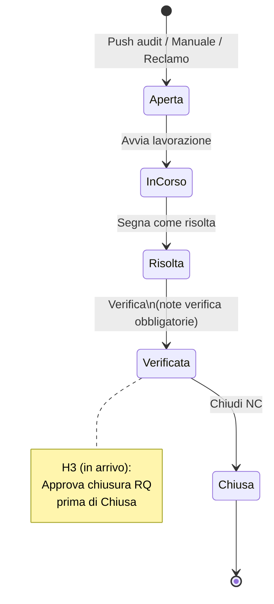

# Manuale utente — Modulo Non Conformità (NC)

> **Versione:** 30/05/2026 · **Ambiente di riferimento:** https://systemgest.netlify.app/nc  
> **Commit produzione (Fase 1):** `55db7b2` · **Simulazione browser:** 30/05/2026 (org Al.project, utente PS_Admin)

---

## Nota sullo stato funzionale

| Area | Stato in produzione (main) | Hardening (working tree / migrazione 072) |
|------|---------------------------|-------------------------------------------|
| Griglia registro, filtri, stats | ? Disponibile | — |
| Creazione manuale, push ISO da audit | ? Disponibile | — |
| Workflow stati + gate note verifica | ? Disponibile | — |
| Azioni correttive per NC | ? Disponibile | — |
| Allegati evidenze su NC | ? Disponibile | — |
| Link audit ? NC, deep-link `?select=` | ? Disponibile | — |
| NC da reclamo | ? Disponibile | — |
| Filtri scadenze NC (scadute / 7 gg) | ? Disponibile | — |
| Push checklist **custom** ? registro NC | ? | **In arrivo** (H1 — codice pronto, deploy pendente) |
| Approvazione RQ prima della chiusura | ? | **In arrivo** (H3 — richiede migrazione 072 + deploy) |
| Export CSV registro | ? | **In arrivo** (H5 — codice pronto, deploy pendente) |
| Vista «Azioni in scadenza» cross-NC | ? | **In arrivo** (hardening UI) |
| Email alert scadenze NC | ?? Backend pronto | Attivare `NC_ALERT_ENABLED` + SMTP sul VPS |

Il riferimento agente `2f36d0c9` **non risulta nel repository**; la baseline verificata è la chiusura **NC Fase 1** documentata in `docs/agent-tasks/DEPUTYTASK.md`.

---

## 1. Introduzione

### Cos'è il modulo NC

Il modulo **Non Conformità & Azioni Correttive** (`/nc`) è il registro organizzativo dello studio QS: raccoglie in un unico elenco tutte le NC e le osservazioni (OSS) emerse da audit ISO, da inserimenti manuali o da reclami, e permette di gestire il ciclo di vita fino alla verifica di efficacia (ISO 9001 §10.2).

### Chi lo usa

| Ruolo | Uso tipico |
|-------|------------|
| **Responsabile Qualità (RQ) / admin** | Panoramica multi-cliente, approvazioni (quando attive), chiusura NC, export |
| **Auditor / consulente** | Push da audit, compilazione cause, azioni, evidenze |
| **Viewer** | Consultazione (se abilitato dal tenant) |

Richiede licenza modulo **`nc`** (voce menu «Non Conformità»). Senza licenza compare la schermata modulo bloccato.

---

## 2. Accesso e permessi

### Come accedere

1. Accedere a https://systemgest.netlify.app con le proprie credenziali.
2. Nel menu laterale SGQ, cliccare **Non Conformità** (icona sirena rossa).
3. Si apre la pagina **Non Conformità & Azioni Correttive** con sottotitolo *ISO 9001:2015 §8.7 + §10.2 - Registro cross-audit*.

### Studio vs cliente

- Il registro è **cross-audit**: una riga per ogni NC, con colonna **Cliente** e filtro **Tutti i clienti**.
- Gli **auditor** vedono le NC nel perimetro del proprio studio (`auditor_org_id`); **admin/superadmin** vedono l'intero tenant.
- Le NC restano collegate all'**audit di riferimento** (numero audit cliccabile nel dettaglio).

### Permessi operativi (sintesi)

| Azione | Admin / superadmin | Auditor | Viewer |
|--------|-------------------|---------|--------|
| Consultare registro | ? | ? (perimetro studio) | ? (lettura) |
| Creare NC manuale | ? | ? | ? |
| Modificare NC aperta | ? | ? | ? |
| Workflow stati | ? | ? | ? |
| Push da audit (chiusura) | ? | ? | ? |
| Allegati evidenze | ? | ? | ? |
| Approvazione chiusura RQ | ? *(in arrivo H3)* | ? | ? |

---

## 3. Scenari operativi

### 3.1 Panoramica RQ — registro multi-cliente

**Chi:** Responsabile Qualità, admin studio.

**Quando:** Controllo periodico del registro NC, preparazione audit di sorveglianza o riesame direzione.

**Passi**

1. Aprire `/nc`.
2. Osservare le **card riepilogo** cliccabili: **Aperte**, **In corso**, **Scadute**, **In scadenza** (se presenti), **Totale**. Un clic applica il filtro corrispondente; un secondo clic lo rimuove.
3. Usare il menu **Tutti i clienti** per restringere a un'azienda (es. *Azienda Test Fase 1*).
4. Cercare per testo nel campo **Cerca per numero NC o descrizione...**.
5. Affinare con **Tutti gli stati**, **Tutte le severità**, **Tutte le scadenze** (Solo scadute / In scadenza 7 gg).
6. Cliccare una riga della griglia per aprire il **pannello dettaglio** sotto la tabella. L'URL diventa `/nc?select=<id>`.

**Domande che mi pongo (FAQ interne)**

- *Vedo tutte le NC dello studio o solo quelle di un cliente?*  
- *Come capisco quali NC sono urgenti?*

**Risposte**

- Con filtro cliente vuoto vedete tutte le NC del vostro perimetro RBAC; con un cliente selezionato solo quelle collegate ad audit di quell'azienda.
- Le NC con scadenza superata mostrano badge ?? sulla colonna N° NC e la card **Scadute** si aggiorna. Usate i filtri scadenza per liste di controllo.

**Screenshot note**

- In alto: titolo con sirena, pulsante blu **+ Nuova NC**, card colorate (rosso/giallo per aperte/in corso).
- Griglia colonne: **N° NC**, **Stato** (pallino colorato), **Severità** (etichetta colorata), **Cliente**, **Audit** (icona documento), **Scadenza**, **Origine** (Manuale / Audit NC / Audit OSS / Reclamo).

---

### 3.2 NC da push audit ISO (NC e OSS)

**Chi:** Auditor al termine o durante la compilazione audit ISO 9001.

**Quando:** L'audit ha risposte **NC** (non conforme) o **OSS** (osservazione) nella checklist ISO e si vuole gestirle nel registro organizzativo.

**Passi**

1. Aprire l'audit da **Audit** ? selezionare l'audit in corso.
2. Compilare la checklist segnando esiti **NC** o **OSS** sulle domande pertinenti (pulsanti esito rosso/giallo della checklist).
3. Andare al pannello **Chiusura audit** (tab o sezione chiusura).
4. Se è presente il blocco **Trasferimento al modulo Non Conformità** con conteggio NC/OSS, cliccare **Trasferisci NC e OSS al modulo NC**.
5. Attendere il messaggio di conferma; entro **10 secondi** è possibile **Annulla trasferimento** se il push era errato.
6. Cliccare il link **modulo NC** o aprire `/nc`: le nuove righe hanno origine **Audit NC** o **Audit OSS** e numero tipo `NC-<audit>-00n`.

**Domande che mi pongo**

- *Posso ripetere il push?*  
- *Cosa succede alle note della domanda?*

**Risposte**

- Il push è **idempotente**: le NC già presenti per la stessa domanda vengono saltate (messaggio «già presenti»).
- Descrizione e riferimento sezione ISO vengono copiati dalla risposta audit; potete arricchirli nel dettaglio NC.

**Screenshot note**

- Pannello chiusura: box «Rilevate X NC e Y OSS» con pulsante ?? verde secondario.
- In registro: origine **Audit OSS** con severità **Osservazione** (viola) o **Audit NC** con severità tipicamente **Lieve/Grave**.

---

### 3.3 NC da push checklist custom

**Chi:** Auditor su audit con checklist personalizzata.

**Quando:** Item custom con esito NC/OSS devono entrare nel registro come per la checklist ISO.

**Passi (quando la funzione sarà in produzione — H1)**

1. Compilare item custom con esito NC o OSS.
2. Dalla chiusura audit, usare lo stesso flusso **Trasferisci NC e OSS al modulo NC** (il backend includerà anche `audit_custom_checklist_responses`).
3. Verificare in `/nc` origine dedicata o badge che richiama l'item custom.

**Stato attuale:** **In arrivo.** In produzione oggi il push trasferisce solo rilievi checklist **ISO** (`audit_responses`). Il codice hardening e la migrazione **072** (`source_custom_item_id`) sono pronti nel repository ma non ancora deployati.

**Domande / Risposte**

- *Perché le NC custom non compaiono?* — Funzione non ancora rilasciata; usare creazione manuale collegata allo stesso audit come workaround temporaneo.

---

### 3.4 NC manuale

**Chi:** RQ, auditor, admin.

**Quando:** Rilievo fuori checklist, NC da verbalizzazione cartacea, integrazione registro senza passare dall'audit.

**Passi**

1. In `/nc`, cliccare **+ Nuova NC**.
2. Nel modale **Nuova NC manuale**, selezionare **Audit di riferimento** (obbligatorio — dropdown con audit aperti o, se assenti, tutti gli audit).
3. Scegliere **Sezione ISO** (clausole 4–10 HLS; default *10 - Miglioramento*).
4. Impostare **Severità** (Grave / Lieve / Osservazione).
5. Compilare **Descrizione** (obbligatoria).
6. Opzionale: **Responsabile NC**, **Scadenza NC**.
7. Cliccare **Crea NC**. La riga appare con origine **Manuale** e numero prefisso `NC-M-...`.

**Domande che mi pongo**

- *Perché il dropdown audit è vuoto?*  
- *Errore «Sezione non valida»?*

**Risposte**

- Se non ci sono audit «aperti», il sistema elenca comunque gli audit disponibili (fix Fase 1). Verificare di avere audit nell'organizzazione.
- Se l'audit è ISO 14001/3834 e si sceglie una sezione HLS ISO 9001, l'API risponde **400** con codice `INVALID_SECTION_FOR_STANDARD`: scegliere un audit ISO 9001 o attendere sezioni dinamiche per standard (backlog P2).

**Screenshot note**

- Modale centrato: titolo ?, campi impilati, pulsanti **Annulla** (bianco) e **Crea NC** (blu).

---

### 3.5 NC da reclamo (link origine)

**Chi:** RQ, addetto reclami.

**Quando:** Un reclamo cliente/fornitore deve generare una NC tracciata nel registro §10.2.

**Passi**

1. Aprire **Reclami** (`/reclami`).
2. Individuare il reclamo e usare l'azione **Promuovi a NC** (o equivalente nella riga).
3. Inserire l'**ID audit** di collegamento quando richiesto dal prompt.
4. Confermare: il sistema crea la NC con `source_type: complaint`.
5. Aprire `/nc`: la NC mostra badge **Reclamo** con link **Reclamo #…** che riporta a `/reclami?complaint=<id>`.

**Domande / Risposte**

- *Posso promuovere due volte lo stesso reclamo?* — No: se esiste già una NC collegata, compare messaggio «NC già esistente» con il numero NC.

**Screenshot note**

- Nel dettaglio NC: badge origine Reclamo + link cliccabile accanto al badge Manuale/Audit.

---

### 3.6 Workflow stati completo e gate note verifica

**Chi:** Auditor (lavorazione), RQ (verifica e chiusura).

**Quando:** Dalla apertura alla chiusura formale della NC secondo ISO 10.2.

**Stati NC (in ordine)**

`Aperta` ? `In corso` ? `Risolta` ? `Verificata` ? `Chiusa`

**Passi**

1. Selezionare la NC in griglia.
2. Nel dettaglio, compilare campi editabili: **Descrizione**, **Analisi causa radice**, **Note verifica efficacia**, **Responsabile verifica**, **Severità**, **Scadenza NC**, **Responsabile NC**.
3. Cliccare **Salva modifiche** dopo ogni modifica sostanziale.
4. Usare i pulsanti workflow (stile checklist — verde/giallo/grigio):
   - **Avvia lavorazione** (Aperta ? In corso)
   - **Segna come risolta** (In corso ? Risolta)
   - **Verifica** (Risolta ? Verificata) — **solo se** le note verifica sono compilate e salvate
   - **Chiudi NC** (Verificata ? Chiusa) — in produzione attuale **senza** gate approvazione RQ; con H3 servirà prima **Approva chiusura (RQ)**
5. Dopo stati **Verificata** o **Chiusa**, i campi diventano in sola lettura.

**Domande che mi pongo**

- *Il pulsante Verifica non fa nulla?*  
- *Posso chiudere senza verificare le azioni?*

**Risposte**

- Se mancano le **Note verifica efficacia**, compare un alert: compilare, **Salva modifiche**, poi riprovare.
- La NC può chiudersi a livello registro anche senza azioni correttive formalizzate, ma per audit ISO è buona pratica registrare almeno un'azione per NC rilevanti.

**Screenshot note**

- Pulsanti workflow sotto il form, allineati a sinistra, classi colorate come in checklist audit.
- NC chiusa: intestazione «NC-… — ? Chiusa», campi grigio/readonly.

---

### 3.7 Azioni correttive — attuazione, responsabile, scadenza, verifica

**Chi:** Referente processo, auditor, RQ.

**Quando:** Per ogni NC serve tracciare cosa si fa, chi lo fa, entro quando, e se ha funzionato.

**Passi**

1. Nel dettaglio NC, scorrere alla sezione **Azioni correttive (n)**.
2. Cliccare **+ Aggiungi azione**.
3. Compilare: **Tipo** (Immediata / Correttiva / Preventiva), **Descrizione***, **Responsabile attuazione**, **Scadenza**.
4. **Salva azione**.
5. Per ogni azione, avanzare lo stato con i pulsanti:
   - **Avvia** ? **Completa** ? **Verifica**
6. Su **Verifica**, compilare **Nota verifica azione** (obbligatoria) e **Conferma verifica**.
7. Se ci sono azioni scadute o in scadenza entro 7 giorni, usare i filtri **Scadute** / **In scadenza 7 gg** sopra l'elenco azioni.

**Domande / Risposte**

- *Posso eliminare un'azione?* — Sì, solo se è ancora **Aperta** (pulsante Elimina).
- *La scadenza azione è quella della NC?* — No: sono indipendenti; la NC ha la sua scadenza nel form principale.

**Screenshot note**

- Lista azioni con badge tipo (Immediata/Correttiva/Preventiva), stato, eventuale badge rosso «Scaduta».

---

### 3.8 Allegati evidenze

**Chi:** Auditor, RQ.

**Quando:** Documentare foto, PDF, registrazioni a supporto della NC o della verifica (facoltativi — mai bloccanti per la compilazione).

**Passi**

1. Nel dettaglio NC, sezione **Allegati evidenze**.
2. Cliccare **Carica file** (o area upload) e selezionare uno o più file.
3. Attendere il completamento; l'elenco mostra nome e dimensione.
4. Per rimuovere: icona elimina ? conferma (non disponibile se NC in sola lettura).

**Domande / Risposte**

- *Gli allegati sono obbligatori?* — No, per policy SGQ; bastano le note testuali per chiudere il workflow.

**Screenshot note**

- Blocco analogo agli allegati checklist: lista file sotto l'etichetta «Allegati evidenze».

---

### 3.9 Approvazione RQ per chiusura (H3 — in arrivo)

**Chi:** Admin o superadmin (Responsabile Qualità organizzativo).

**Quando:** La NC è in stato **Verificata** e si vuole autorizzare la chiusura formale.

**Passi (dopo deploy hardening)**

1. Aprire NC in stato **Verificata** con note verifica compilate.
2. L'RQ clicca **Approva chiusura (RQ)**.
3. Compare badge «Approvata RQ» con data e nome approvatore.
4. Solo allora appare **Chiudi NC**.

**Stato attuale in produzione:** la NC può passare da Verificata a Chiusa **senza** approvazione intermedia. Il gate è implementato nel codice hardening + migrazione **072** (`approved_by`, `approved_at`).

**Domande / Risposte**

- *Perché non vedo «Approva chiusura»?* — Funzione non ancora in produzione, oppure utente senza ruolo admin/superadmin.

---

### 3.10 Filtri scadenze — NC scadute e in scadenza 7 giorni

**Chi:** RQ, auditor.

**Quando:** Controllo settimanale scadenze, preparazione report interno.

**Passi**

1. Usare la card **Scadute** o il menu **Tutte le scadenze ? Solo scadute**.
2. Per il preavviso: **In scadenza (7 gg)** (card o menu filtri).
3. Combinare con filtro **Aperte** / **In corso** per escludere NC già chiuse.

**Domande / Risposte**

- *Una NC chiusa compare tra le scadute?* — No: stati terminali `verified` e `closed` sono esclusi dal conteggio scadenze API.

---

### 3.11 Export CSV registro (H5 — in arrivo)

**Chi:** RQ, admin.

**Quando:** Archivio elettronico, analisi Excel, consegna al cliente.

**Passi (dopo deploy)**

1. Applicare i filtri desiderati sulla griglia.
2. Cliccare **Export CSV** in alto a destra.
3. Si scarica `registro-nc-YYYY-MM-DD.csv` con le righe **filtrate** (UTF-8 con BOM).

**Stato attuale:** pulsante **non presente** in produzione; implementato in `ncExportHelpers.js` nel branch hardening.

---

### 3.12 Link audit ? NC e deep-link

**Chi:** Tutti gli utenti con licenza NC.

**Quando:** Navigare tra audit e registro, condividere link diretto a una NC.

**Passi**

- **Da registro a audit:** nel dettaglio NC, cliccare il link **?? &lt;numero audit&gt;** ? pagina Audit.
- **Da audit a registro:** dopo push, link nel pannello chiusura; in **Rilievi pendenti** (re-audit), link **Apri NC nel registro** ? `/nc?select=<nc_id>`.
- **Deep-link:** aprire o condividere `https://systemgest.netlify.app/nc?select=1043` (sostituire l'ID).

**Domande / Risposte**

- *Il link non seleziona la riga?* — Aggiornare la pagina; verificare che l'ID esista e sia nel perimetro RBAC.

---

### 3.13 Ruolo auditor vs admin (RBAC)

**Chi:** Amministratore tenant, auditor.

**Quando:** Configurazione team o verifica visibilità dati.

**Sintesi verificata**

- **Superadmin / admin:** vedono tutte le NC del tenant; possono gestire licenze e (con H3) approvare chiusure.
- **Auditor:** NC e audit filtrati per **studio** (`auditor_org_id`); devono avere uno studio assegnato.
- **Viewer:** sola lettura nel perimetro assegnato.

**Passi di verifica (admin)**

1. Accedere come auditor di studio A: in `/nc` comparire solo clienti/audit di quello studio.
2. Accedere come admin: comparire tutti i clienti del tenant nel filtro.

---

### 3.14 Errori comuni

#### Sezione ISO incompatibile con lo standard audit

**Sintomo:** messaggio «Sezione non valida per lo standard dell'audit selezionato» o errore 400 `INVALID_SECTION_FOR_STANDARD`.

**Causa:** audit ISO 14001/45001/3834 con sezione HLS ISO 9001 nel modale manuale.

**Cosa fare:** scegliere audit ISO 9001; oppure attendere dropdown sezioni per standard (backlog).

#### Note verifica mancanti

**Sintomo:** alert al clic su **Verifica** o **Chiudi NC**.

**Cosa fare:** compilare **Note verifica efficacia** ? **Salva modifiche** ? riprovare il cambio stato.

#### Chiusura senza approvazione RQ (futuro H3)

**Sintomo (post-H3):** alert «Approvazione del Responsabile Qualità richiesta».

**Cosa fare:** utente admin clicca **Approva chiusura (RQ)** prima di **Chiudi NC**.

#### Modulo NC non visibile

**Sintomo:** voce menu assente o pagina bloccata.

**Causa:** licenza modulo `nc` non attiva per l'organizzazione.

**Cosa fare:** admin tenant ? **Licenze moduli** ? abilitare NC.

---

## 4. FAQ — Domande e risposte

| Domanda | Risposta breve |
|---------|----------------|
| Qual è la differenza tra OSS e NC? | OSS = osservazione (miglioramento consigliato); NC = non conformità da trattare con maggiore rigore. Entrambe finiscono nel registro con severità e workflow uguale. |
| Devo caricare allegati per chiudere? | No, non sono obbligatori. |
| Posso modificare una NC chiusa? | No, i campi diventano readonly dopo chiusura/verifica (salvo riapertura futura — non prevista in Fase 1). |
| Il push da audit elimina le risposte checklist? | No, copia nel registro; la checklist audit resta invariata. |
| Come annullo un push errato? | Entro 10 secondi: **Annulla trasferimento** nel pannello chiusura audit. |
| Arrivano email per scadenze NC? | Solo se ops attiva `NC_ALERT_ENABLED` e SMTP sul VPS. |
| Export PDF del registro? | Non ancora; solo CSV in arrivo (H5). |

---

## 5. Glossario

| Termine | Significato |
|---------|-------------|
| **NC** | Non Conformità — mancato adempimento a un requisito (ISO §10.2). |
| **OSS** | Osservazione — punto di miglioramento senza evidenza di non conformità grave. |
| **CAPA** | Corrective And Preventive Action — azioni correttive e preventive. |
| **Verifica efficacia** | Controllo che l'azione correttiva abbia eliminato la causa (ISO 10.2.1 e). |
| **Causa radice** | Motivo profondo del problema (5 Why, Ishikawa, 8D…). |
| **Registro cross-audit** | Unico elenco NC di tutti gli audit/clienti dello studio. |
| **Push** | Trasferimento automatico rilievi checklist ? registro NC. |
| **Gate** | Regola che blocca un cambio stato finché un campo obbligatorio manca. |
| **HLS** | High Level Structure — clausole 4–10 comuni alle norme ISO. |
| **RQ** | Responsabile Qualità — tipicamente admin org con approvazione chiusura (H3). |

---

## 6. Troubleshooting

| Problema | Verifica | Azione |
|--------|----------|--------|
| Griglia vuota | Filtri attivi, card selezionata | **Azzera filtri**, clic card **Totale** |
| Dettaglio non si apre | Bug noto snapshot a11y | Usare deep-link `/nc?select=<id>` o ricliccare riga |
| Dropdown audit vuoto in modale | Nessun audit in org | Creare/aprire un audit; fix Fase 1 elenca anche audit completati |
| 500 su creazione NC | Sezione vs standard | Usare audit ISO 9001; leggere messaggio 400 sezione |
| Allegati non caricano | Rete / permessi | Controllare console rete; riprovare file più piccolo |
| NC duplicate dopo push | Push ripetuto | Normale: idempotenza salta duplicati; verificare colonna Origine |

---

## 7. Riferimenti ISO semplificati

| Requisito ISO 9001:2015 | Cosa fa il modulo |
|-------------------------|-------------------|
| **8.7** Controllo output non conforme | Registra NC/OSS emerse da audit o reclami. |
| **10.2** NC e azioni correttive | Workflow stati, cause, azioni, verifica efficacia, tracciabilità. |
| **10.2.1 a)** Reazione alla NC | Stati Aperta/In corso, azioni immediate. |
| **10.2.1 b)** Valutazione cause | Campo **Analisi causa radice**. |
| **10.2.1 c)** Azioni correttive | Sezione **Azioni correttive** con tipi e responsabili. |
| **10.2.1 e)** Verifica efficacia | **Note verifica efficacia** + gate obbligatorio prima di Verificata/Chiusa. |
| **9.1** Monitoraggio | Filtri scadenze, stats card, (futuro) export CSV. |

*Questo manuale non sostituisce la procedura qualità certificata dello studio; adattare tempistiche e responsabilità al proprio manuale SGQ.*

---

## 8. Adattamento Canvas

### Proposta struttura Canvas interattivo

| Capitolo Canvas | Contenuto |
|-----------------|-----------|
| **Home NC** | Video/gif 30s + link app `/nc` |
| **Scenario card** | Una card per sezione H2 sopra (14 scenari) |
| **Diagramma stati** | Mermaid interattivo (clic stato ? mostra gate) |
| **FAQ flash** | Card flip domanda/risposta |
| **Checklist verificatore** | Checkbox stampabile pre-audit |
| **In arrivo** | Badge su H1/H3/H5 finché non deployati |

### Pro e contro vs PDF / Markdown statico

| | Canvas | Markdown/PDF |
|---|--------|--------------|
| **Pro** | Navigazione per scenario, diagramma cliccabile, aggiornamento centralizzato, link live all'app | Stampabile, versionabile in Git, zero manutenzione UI |
| **Contro** | Richiede hosting Canvas, sync con release app | Nessuna interattività, screenshot statici invecchiano |

**Parere:** per **formazione auditor** il Canvas è utile sul diagramma stati e sulle card scenario; per **audit di certificazione** resta preferibile questo Markdown (+ eventuale PDF export) come evidenza versionata. Consiglio ibrido: Canvas come portal, Markdown come fonte unica su Git.

### Bozza diagramma flusso stati (Mermaid per Canvas)

---

## Riferimenti tecnici (per manutentori)

- Codice UI: `app/src/pages/NCPage.jsx`, `NcDetailPanel.jsx`, `NcCreateModal.jsx`
- Workflow: `app/src/utils/ncWorkflow.js`
- API: `GET/POST /api/v1/non-conformities`, `PUT /non-conformities/:id`
- Push audit: `POST /api/v1/audits/:id/push-to-nc-register`
- Documentazione ops: sezione «Modulo NC organizzativo — Fase 1» in `docs/GUIDA_CONSOLIDATA.md`

---

*Ultimo aggiornamento: 30/05/2026 — generato post-simulazione produzione e analisi hardening 072.*
