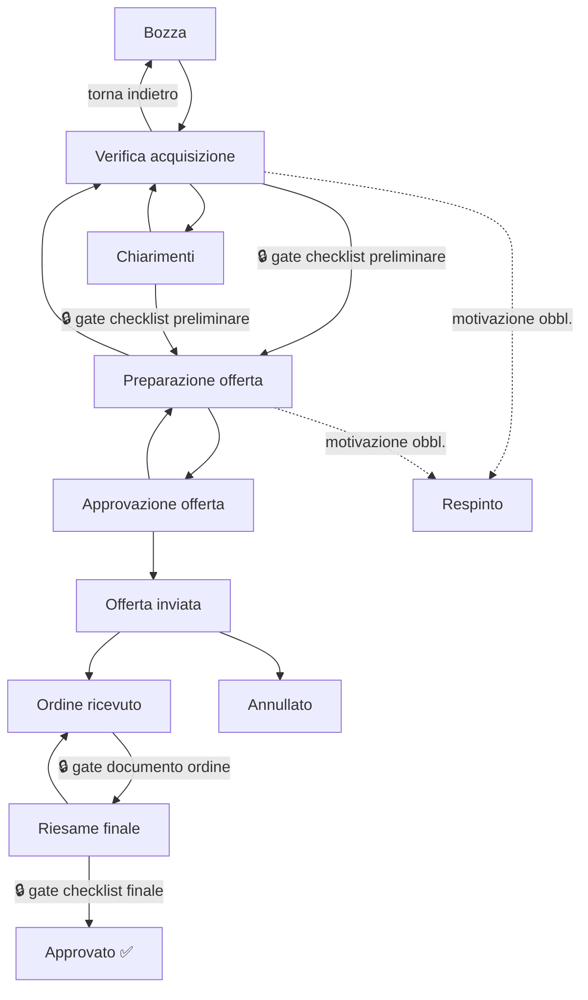

# Manuale Utente — Riesame Requisiti Contratto (ISO 9001 §8.2)

> Guida operativa al modulo **Riesame Requisiti** (`/contract-reviews`). Copre workflow stati, le 6 sezioni ("tab") della pagina caso e i requisiti obbligatori per avanzare.  
> Riferimento tecnico: [MINI_SPEC_RIESAME_REQUISITI_CONTRATTO.md](../specs/MINI_SPEC_RIESAME_REQUISITI_CONTRATTO.md)

---

## 1. Cos'è e a cosa serve

Il modulo traccia il percorso di un'opportunità commerciale — dalla richiesta del cliente all'ordine confermato — verificando che l'azienda abbia le capacità per soddisfare i requisiti (ISO 9001 §8.2). Ogni caso passa attraverso **11 stati** in sequenza, con **controlli obbligatori** (checklist, documenti) prima di alcuni passaggi.

---

## 2. Mappa degli stati (workflow)



**Stati terminali** (non più modificabili): `Approvato`, `Annullato`, `Respinto`.

**Passaggi indietro consentiti**: sempre richiedono una motivazione scritta (tracciata nella Cronologia).

---

## 3. I 3 "cancelli" (gate) — dove ti puoi bloccare

| # | Passaggio | Cosa richiede | Dove si compila |
|---|---|---|---|
| 🔒 1 | Verifica acquisizione / Chiarimenti → **Preparazione offerta** | Checklist **preliminare** generata e **tutte le voci compilate** | Tab **Checklist** → "Genera preliminare" |
| 🔒 2 | Ordine ricevuto → **Riesame finale** | Almeno **1 documento con ruolo "Ordine"** collegato o caricato | Tab **Documenti** |
| 🔒 3 | Riesame finale → **Approvato** | Checklist **finale** generata e **tutte le voci compilate** | Tab **Checklist** → "Genera finale" |

Se un pulsante di avanzamento stato è **grigio/disabilitato**, il motivo esatto appare come testo sotto i pulsanti (tab Workflow).

---

## 4. Le 6 sezioni della pagina caso (tab)

| Tab | Quando si usa | Contenuto |
|---|---|---|
| **Workflow** | Sempre, punto di partenza | Dati caso (titolo, azienda, committente, note), pulsanti avanzamento stato, cronologia stati, handoff a esecuzione (solo se Approvato) |
| **Checklist** | Prima di "Preparazione offerta" (preliminare) e prima di "Approvato" (finale) | 10 voci preliminari (P1-P10) + 6 voci finali (F1-F6), risposta Sì/No/N.A./Parziale + note |
| **Chiarimenti** | Quando servono info dal cliente | Elenco richieste/risposte, tracciate con data |
| **Documenti** | Sempre — caricamento/collegamento file | Collega da registro documentale o carica file diretto (RFQ, offerta, ordine, disegno...) — dettaglio in [§8](#8-tab-documenti--come-caricarecollegare-file-dettaglio) |
| **Requisiti da disegno** | Se il caso ha un disegno tecnico caricato | Estrazione AI automatica di quote, materiali, tolleranze dal disegno |
| **Analisi AI** | In qualsiasi momento, opzionale | Incolla/carica il capitolato → l'AI confronta i requisiti con le capacità dell'azienda SGQ selezionata |

---

## 5. Checklist preliminare (P1–P10) — cosa verifica

| Rif. | Voce |
|---|---|
| P1 | Requisiti tecnici del cliente chiaramente identificati |
| P2 | Norme e standard applicabili identificati |
| P3 | Capacità produttiva adeguata ai requisiti |
| P4 | Competenze e qualifiche del personale disponibili |
| P5 | Attrezzature e strumenti necessari disponibili |
| P6 | Documentazione di sistema applicabile aggiornata |
| P7 | Requisiti di consegna e tempistiche realizzabili |
| P8 | Requisiti legali e cogenti applicabili identificati |
| P9 | Subforniture necessarie identificate |
| P10 | Rischi contrattuali valutati |

## 6. Checklist finale (F1–F6) — cosa verifica

| Rif. | Voce |
|---|---|
| F1 | Ordine conforme all'offerta inviata |
| F2 | Variazioni rispetto all'offerta documentate |
| F3 | Capacità confermata alla data dell'ordine |
| F4 | Qualifiche personale ancora valide per la commessa |
| F5 | Piano qualità/controlli definito |
| F6 | Responsabile commessa assegnato |

---

## 7. Committente commerciale — come si compila

Dal 07/07/2026 il campo **Committente commerciale** (tab Workflow → Dati caso) è un **menu a tendina** collegato all'anagrafica **Controparti** dell'azienda SGQ selezionata:

1. Seleziona prima l'**Azienda SGQ (capacità)**
2. Il menu **Committente commerciale** si popola con le controparti collegate (ruolo Cliente diretto o Committente finale)
3. Se il committente non è ancora in anagrafica: usa il campo testo libero che appare quando nessuna controparte è selezionata — comparirà un badge **legacy** finché non lo collegherai a un'anagrafica

> Anagrafica controparti: pagina **Aziende** → scheda azienda → tab **Controparti**.

---

## 8. Tab Documenti — come caricare/collegare file (dettaglio)

Il tab **Documenti** offre **due modalità distinte**, entrambe disponibili finché il caso non è in stato terminale:

### 8.1 Collega da registro (documento già esistente)

Usa questa opzione se il file è già archiviato nel **Registro Documentale** dell'app (menu Documenti):

1. Inserisci l'**ID documento** (numero visibile nella pagina Documenti)
2. Scegli il **ruolo**: Ordine · RFQ · Capitolato · Offerta · Disegno · Altro
3. Scegli **controparte** (Cliente / Fornitore / Interno) e **direzione** (In entrata / In uscita)
4. Se controparte = Fornitore, seleziona anche il fornitore anagrafico (opzionale)
5. Clic **Collega** — non carica un nuovo file, crea solo il collegamento al caso

### 8.2 Carica allegato caso (file nuovo)

1. Scegli **ruolo** e **controparte/direzione** come sopra
2. Clic sul campo file: puoi selezionare **più file insieme** (multi-upload)
3. Ogni file viene caricato in sequenza con barra di progresso (`Caricamento 1/3… nomefile.pdf`)
4. Se un file fallisce, l'errore compare sotto **senza bloccare** il caricamento degli altri file

### 8.3 Analisi AI automatica dopo l'upload

Alcune combinazioni **ruolo + formato** avviano da sole l'estrazione AI in background (banner blu "Analisi AI avviata"):

| Ruolo caricato | Formato richiesto | Estrazione automatica |
|---|---|---|
| **Disegno** | qualsiasi | Requisiti tecnici (quote, materiali, tolleranze, saldature) → visibili nel tab "Requisiti da disegno" |
| **Capitolato** | solo PDF | Testo/requisiti → visibili nel tab "Analisi AI" o nei suggerimenti checklist |
| **Ordine** | solo PDF | Testo/requisiti → stessa pipeline del Capitolato |
| Altri ruoli (RFQ, Offerta, Altro) | — | Nessuna estrazione automatica |

Se hai caricato più allegati senza innesco automatico (es. RFQ, Offerta), in fondo alla sezione compare il pulsante **"Analizza documenti commessa"** per lanciare l'analisi su tutti gli allegati compatibili in un colpo.

### 8.4 Elenco documenti e allegati

In fondo al tab trovi due liste separate:
- **Documenti registro** — quelli collegati dal Registro Documentale (badge controparte · direzione)
- **Allegati file** — quelli caricati direttamente sul caso (badge ruolo + controparte · direzione)

---

## 9. Esempio pratico — percorso completo di un caso

```
1. Crea caso (pulsante "Nuovo Riesame") → titolo, azienda SGQ, committente
   → stato iniziale: Bozza

2. Tab Workflow → avanza a "Verifica acquisizione"

3. Tab Checklist → "Genera preliminare" → compila P1-P10

4. (se servono info al cliente) Tab Chiarimenti → invia richiesta → attendi risposta

5. Tab Workflow → avanza a "Preparazione offerta" (ora sbloccato)

6. Tab Documenti → carica offerta (ruolo "Offerta")

7. Tab Workflow → avanza a "Approvazione offerta" → "Offerta inviata"

8. Cliente conferma → Tab Documenti → carica ordine (ruolo "Ordine")

9. Tab Workflow → avanza a "Ordine ricevuto" → "Riesame finale" (ora sbloccato)

10. Tab Checklist → "Genera finale" → compila F1-F6

11. Tab Workflow → avanza a "Approvato" ✅

12. (solo se Approvato) Tab Workflow → "Passaggio a esecuzione"
    → registra riferimento commessa + verifica copertura saldatori (se applicabile)
```

---

## 10. Analisi AI del capitolato — cosa fa davvero

1. Incolli o carichi il testo del capitolato/RFQ nel tab **Analisi AI**
2. L'AI confronta i requisiti del testo con le **capacità dell'azienda SGQ** collegata al caso
3. Restituisce: rischio complessivo, elenco requisiti con valutazione (Soddisfatto / Gap / Da verificare), azioni suggerite
4. Puoi applicare i suggerimenti direttamente alle note della checklist preliminare con un pulsante dedicato

**Nota**: richiede che l'azienda SGQ sia selezionata sul caso — altrimenti l'AI non ha capacità da confrontare.

---

*Aggiornato: 07/07/2026 — dettaglio upload/collegamento documenti (§8) + select controparti committente (PR #230, #233).*
