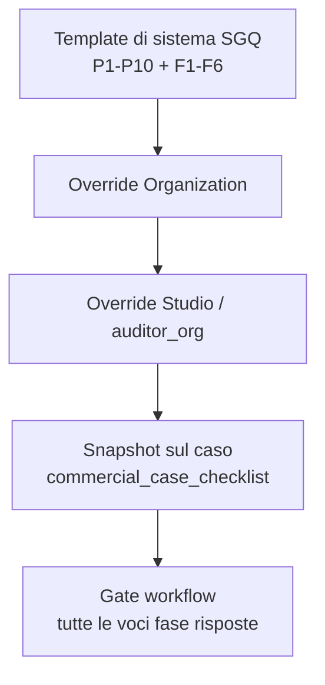

# Mappa gap — Riesame requisiti di commessa + personalizzazione checklist per studio

> **Versione**: 1.0 — 2026-08-01  
> **Modulo**: Riesame Requisiti (`/contract-reviews`, entità `commercial_cases`)  
> **Norma**: ISO 9001:2015 §8.2 (non §9.3 Riesame di Direzione)  
> **Focus**: studi diversi → checklist diverse; personalizzazione controllata senza rompere i gate ISO.

---

## 1. Problema di prodotto

Oggi ogni caso di riesame genera **sempre le stesse voci**:

- preliminare **P1–P10**
- finale **F1–F6**

Fonte unica hardcoded in:

```25:45:backend/src/controllers/contractReview.controller.js
const PRELIMINARY_ITEMS = [
    { ref: 'P1', text: 'Requisiti tecnici del cliente chiaramente identificati' },
    // ...
    { ref: 'P10', text: 'Rischi contrattuali valutati' },
];

const FINAL_ITEMS = [
    { ref: 'F1', text: "Ordine conforme all'offerta inviata" },
    // ...
    { ref: 'F6', text: 'Responsabile commessa assegnato' },
];
```

Questo va bene come **template di sistema ISO generico**, ma non basta se:

| Studio / contesto | Esigenza tipica |
|-------------------|-----------------|
| Studio consulenza multi-cliente | Checklist base ISO + voci studio proprie |
| Studio saldatura / ISO 3834 | Voci su WPS, WPQR, patentini, materiale d’apporto |
| Studio meccanica / carpenteria | Voci su tolleranze, trattamenti, NDT, packing |
| Studio con clienti regolati | Voci legali/export/penali custom |
| Due studi nella stessa org | Template diversi per `auditor_org` |

**Obiettivo**: rendere le checklist **configurabili per studio**, mantenendo:

1. gate di avanzamento stato;
2. storico immutabile delle risposte sul caso;
3. default di sistema per chi non personalizza;
4. compatibilità AI (suggerimenti su testo voce, non solo su `P9`).

---

## 2. Stato attuale (as-is) — checklist riesame

| Aspetto | Stato oggi | Impatto |
|---------|------------|---------|
| Definizione voci | Hardcoded nel controller | Nessuna UI di configurazione |
| Persistenza risposte | `commercial_case_checklist` (phase, item_ref, item_text, answer, notes) | Buona base: il testo è già snapshot sul caso |
| Gate workflow | Conta solo «tutte le voci della fase hanno risposta» | **Favorevole** alla personalizzazione (non dipende da P1/F1 fissi) |
| Generazione | `POST /:id/generate-checklist` idempotente per `item_ref` | Aggiungere voci nuove ok; rinominare ref va gestito |
| Scope tenant | Solo `organization_id` sul caso | Non c’è ancora template per studio (`auditor_org_id`) |
| UI speciale | Highlight hardcode su `item_ref === 'P9'` (subforniture) | Accoppiamento fragile a ref fissi |
| AI → checklist | Match testuale su `item_text`/`item_ref` | Funziona anche con voci custom se i testi sono chiari |
| Export Word/PDF riesame | Assente | Gap separato |
| Handoff → progetto | Stub `handoff_ref` | Gap separato |

### Cosa già funziona bene (da non buttare)

- Snapshot `item_text` sulla riga del caso → se il template cambia dopo, i casi vecchi restano coerenti.
- Gate generici per fase (`preliminary` / `final`) → non serve forzare P1–P10.
- Fasi già modellate (`preliminary|final`).
- Risposte tipizzate (`yes|no|na|partial`) adatte al riesame §8.2 (diverso dal “verbale” audit).

---

## 3. Pattern già presenti in prodotto (riuso intelligente)

### 3.1 Checklist personalizzate audit (già mature)

Esiste già:

- tabelle `custom_checklists` / `_sections` / `_items`
- scope `organization_id` + opzionale `auditor_org_id` (studio)
- UI Admin `CustomChecklistsPage`
- risposte audit con `evidence_blocks` (modello **verbale**)

**Non riusare 1:1** per il riesame commerciale, perché:

| Checklist audit custom | Checklist riesame §8.2 |
|------------------------|------------------------|
| Tipo risposta «verbale» + allegati | Tipo risposta yes/no/na/partial + note |
| Nessun gate di workflow commerciale | Gate obbligatori su transizioni stato |
| Collegata ad `audits` | Collegata a `commercial_cases` |
| Sezioni libere | Due fasi normative (`preliminary` / `final`) |

### 3.2 Riesame tecnico ISO 3834 su commessa

`projects.technical_review_checklist` (mig. 128) = JSON su progetto saldatura.  
Utile come riferimento UX, **non** come modello del riesame commerciale.

### Decisione architetturale proposta

> Creare un **catalogo template dedicato al riesame requisiti** (non mescolare con `custom_checklists` audit), riusando però:
>
> - pattern di scope **org + studio** (`auditor_org_id`);
> - pattern UI admin già noto agli utenti;
> - snapshot voci sul caso (già presente).

Nome working proposto:

- `commercial_review_checklist_templates`
- `commercial_review_checklist_template_items`
- FK opzionale sul caso: `commercial_cases.checklist_template_id` (o risoluzione runtime alla generate)

---

## 4. Mappa gap complessiva del modulo (priorità)

### P0 — Personalizzazione checklist (focus di questa mappa)

| ID | Gap | Perché conta | Effort |
|----|-----|--------------|--------|
| **CL-1** | Template checklist non configurabili | Studi diversi bloccati su P/F fissi | M |
| **CL-2** | Nessuna UI admin per template riesame | Config solo via codice/deploy | M |
| **CL-3** | Nessuno scope per studio (`auditor_org`) | Due studi stessa org condividono lo stesso set | S–M |
| **CL-4** | Accoppiamenti hardcoded a `P9` in UI | Rompono highlight/logiche su template custom | S |
| **CL-5** | Nessuna policy di versionamento template | Cambiare voci a runtime rischia ambiguità sui casi aperti | M |

### P1 — Completamenti funzionali correlati

| ID | Gap | Note |
|----|-----|------|
| **CR-1** | Export Word/PDF del riesame | Serve dopo che le checklist diventano variabili |
| **CR-2** | Handoff crea progetto reale | Oggi solo riferimento testuale |
| **CR-3** | RAG capacità/qualifiche in Analisi AI | Migliora suggerimenti sulle voci custom |
| **CR-4** | Badge contatore menu / N2 | UX inbox |

### P2 — Estensioni commerciali

| ID | Gap | Note |
|----|-----|------|
| **CR-5** | Committente multi-livello | Cliente del cliente |
| **CR-6** | Gare / contratti quadro | Fuori percorso «ordine diretto» |
| **CR-7** | Approvazione economica management | Ruolo dedicato |

---

## 5. Proposta funzionale — checklist personalizzabili per studio

### 5.1 Livelli di personalizzazione (dal più semplice al più ricco)



| Livello | Chi lo gestisce | Comportamento |
|---------|-----------------|---------------|
| **Sistema** | Prodotto SGQ | Default se nessuno override |
| **Organization** | Admin org | Template default per tutti gli studi dell’org |
| **Studio** (`auditor_org_id`) | Admin/studio lead | Override del default org |
| **Caso** | Operatore | Solo compilazione; niente edit strutturale in v1 (evita bypass gate) |

**Regola di risoluzione alla generate:**

1. se il caso ha già checklist generata → non rigenerare voci esistenti (idempotenza attuale);
2. altrimenti cerca template attivo per `(organization_id, auditor_org_id, phase)`;
3. se assente → template org;
4. se assente → template sistema.

> Nota scope: oggi `commercial_cases` non ha `auditor_org_id`. In v1 si può risolvere lo studio da `req.user.auditor_org_id` e/o dalla company collegata (`companies.auditor_org_id`). Decisione da chiudere in slice CL-3.

### 5.2 Modello dati proposto (slice DB)

```text
commercial_review_checklist_templates
  id
  organization_id          NULL = template di sistema
  auditor_org_id           NULL = default org / sistema
  name
  phase                    'preliminary' | 'final'   -- oppure un template con due fasi
  is_active
  is_system                BIT
  version                  INT
  created_at / updated_at / created_by

commercial_review_checklist_template_items
  id
  template_id
  item_ref                 es. 'P1', 'S-WPS-01', '§8.2.3'
  item_text
  display_order
  is_required              default 1  -- in v1 tutte required per il gate
  help_text                NULL
  tags                     NULL  -- es. 'subcontract','welding' (per highlight/AI)
```

Estensioni minime sul caso:

```text
commercial_cases.checklist_template_preliminary_id  NULL
commercial_cases.checklist_template_final_id        NULL
-- oppure un solo checklist_template_set_id se si modellano due fasi nello stesso set
```

Su `commercial_case_checklist` (già presente) aggiungere opzionale:

```text
template_item_id   NULL   -- tracciabilità verso la voce di template
tag_flags          NULL   -- copia tag utili (es. subcontract) per UI/AI
```

### 5.3 Comportamento generate / gate / AI

| Area | Comportamento target |
|------|----------------------|
| **Generate** | Usa template risolto; inserisce snapshot `item_ref`+`item_text`; idempotente |
| **Gate** | Invariato: fase completa = tutte le voci required con risposta |
| **Edit template** | Non altera casi già generati; nuova `version` o nuovo template |
| **Casi aperti** | Opzione v1: «Rigenera mancanti» (aggiunge solo ref nuovi); vietato cancellare voci già risposte |
| **AI apply** | Match su testo/tag, non su `P9` hardcoded |
| **Highlight subforniture** | Se voce ha tag `subcontract` **oppure** testo contiene subfornitur* |

### 5.4 UI proposta

#### A) Admin — «Template riesame requisiti»

Nuova sezione (o tab accanto a Checklist personalizzate audit):

- elenco template per fase (Prelim / Finale)
- scope: Organizzazione / Studio
- editor voci: ref, testo, ordine, tag, help
- azioni: «Duplica da sistema», «Attiva», «Disattiva»
- preview gate: «N voci required → bloccano avanzamento»

#### B) Caso riesame — tab Checklist

- mostra nome/version template usato
- se nessuna checklist ancora: bottone «Genera da template studio»
- se template studio assente: badge «Template di sistema»
- rimuovere dipendenze UI a `P9` fisso

---

## 6. Slice di implementazione consigliate

| Slice | Deliverable | DoD |
|-------|-------------|-----|
| **CL-A** | Migrazione tabelle template + seed sistema (= P/F attuali) | Generate senza UI usa ancora default; zero regressioni |
| **CL-B** | Service risoluzione template + `generateChecklist` legge DB | Hardcode controller deprecato/rimosso |
| **CL-C** | API CRUD template (org-scoped, studio-scoped) | Test Jest multi-tenant + isolamento studio |
| **CL-D** | UI Admin template riesame | Studio può creare/attivare il proprio set |
| **CL-E** | Disaccoppio UI da `P9` + tag `subcontract` | Highlight funziona su voci custom |
| **CL-F** | (opz.) Export Word riesame basato su snapshot caso | Report fedele alle voci compilate |
| **CL-G** | (opz.) Assegnazione template per settore/cliente | Solo dopo feedback studi pilota |

**Ordine consigliato:** CL-A → CL-B → CL-C → CL-E → CL-D → CL-F.

Perché CL-E prima di CL-D: evita che la prima checklist custom “rompi” highlight/AI il giorno del go-live UI.

---

## 7. Decisioni aperte (da chiudere prima del coding)

| # | Domanda | Opzioni | Raccomandazione |
|---|---------|---------|-----------------|
| D1 | Scope personalizzazione | Solo org / org+studio / anche per company | **org + studio** (allineato ad audit custom) |
| D2 | Un template con 2 fasi o 2 template | Set unico vs prelim+final separati | **2 template** (più semplice da attivare) |
| D3 | Chi può editare | solo admin org / anche lead studio | Admin org + lead studio sul proprio `auditor_org` |
| D4 | Casi già aperti quando cambia template | freeze / sync mancanti / force regen | **freeze + «aggiungi mancanti»** |
| D5 | Voci non obbligatorie | tutte required v1 / supportare optional | **tutte required in v1** (gate semplice) |
| D6 | Riuso tabella `custom_checklists` | riuso / catalogo dedicato | **catalogo dedicato** (modello risposta diverso) |
| D7 | Licenza | dentro `ai_review` / flag config separato | **dentro `ai_review`** in v1 |

---

## 8. Rischi e guardrail

| Rischio | Mitigazione |
|---------|-------------|
| Studio svuota checklist → bypass qualità | Impedire attivazione template con 0 voci; minimo N voci configurabile (es. ≥ 3) |
| Ref duplicati | Unique `(template_id, item_ref)` |
| Regressione gate | Test workflow esistenti devono restare verdi col seed sistema |
| Confusione con checklist audit | Naming UI: «Template Riesame Requisiti», menu distinto |
| AI suggerisce su voci sbagliate | Preferire tag + similarità testo; non hardcode P* |
| Multi-tenant leak | Tutte le query con `organization_id`; studio vede solo i propri override |

---

## 9. Criteri di accettazione prodotto (Definition of Done personalizzazione)

1. Studio A e Studio B (stessa org) possono avere **template preliminari diversi**.
2. Nuovo caso di Studio A genera le voci A; Studio B genera le voci B.
3. Org senza override continua a vedere **P1–P10 / F1–F6** identici a oggi.
4. Gate → `QUOTE_PREP` / → `APPROVED` restano bloccati finché tutte le voci required della fase non hanno risposta.
5. Modificare un template **non riscrive** i casi già generati.
6. Highlight subforniture e «Applica suggerimenti AI» funzionano senza dipendere da `P9`.
7. Test L1: workflow + generate + isolamento studio verdi.

---

## 10. Sintesi esecutiva

| Domanda | Risposta breve |
|---------|----------------|
| Le checklist sono già personalizzabili? | **No** — hardcoded P/F |
| Serve un nuovo modulo enorme? | **No** — catalogo template + generate da DB |
| Si possono riusare le checklist audit? | Solo il **pattern di scope/UI**, non le tabelle |
| Qual è il vincolo ISO da preservare? | Gate «fase completa» + storico risposte sul caso |
| Prima cosa da fare? | Seed template sistema + generate da DB (CL-A/B), poi UI admin per studio |

---

## 11. Riferimenti

- Mini-spec: [`MINI_SPEC_RIESAME_REQUISITI_CONTRATTO.md`](MINI_SPEC_RIESAME_REQUISITI_CONTRATTO.md)
- Manuale utente: [`../how-to/MANUALE_UTENTE_RIESAME_REQUISITI.md`](../how-to/MANUALE_UTENTE_RIESAME_REQUISITI.md)
- Checklist audit personalizzate: [`../ROADMAP_TEMPLATE_E_CHECKLIST_PERSONALIZZATE.md`](../ROADMAP_TEMPLATE_E_CHECKLIST_PERSONALIZZATE.md)
- Schema utenti/checklist: [`../SCHEMA_UTENTI_CHECKLIST_SISTEMI_REPORT.md`](../SCHEMA_UTENTI_CHECKLIST_SISTEMI_REPORT.md)
- Codice attuale voci: `backend/src/controllers/contractReview.controller.js`
- Gate: `backend/src/services/contractReviewWorkflow.service.js`

---

*Documento di analisi/prodotto — nessuna implementazione inclusa. Prossimo passo operativo: chiudere decisioni D1–D7, poi aprire slice CL-A.*
