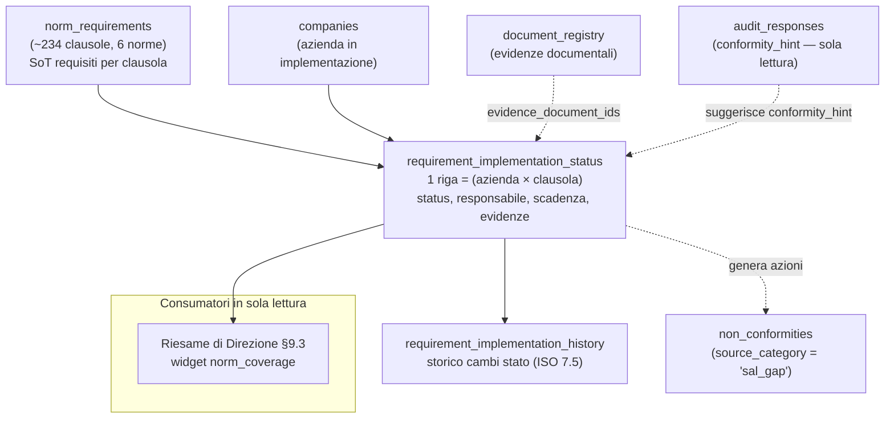

# Modulo SAL (Stato Avanzamento Lavori) — Scopo e Roadmap

> **Tipo documento**: spec di prodotto + architettura + roadmap a fasi incrementali (base Sprint 4)
> **Versione**: 1.0 — 2026-06-24
> **Autore**: analisi senior product + software architect (solo lettura codice, nessuna modifica al sorgente)
> **Verdetto analisi strategica**: **«Sì, con condizioni»** — il SAL si costruisce su un **motore dati di gap analysis operativa clausola-per-clausola**, condiviso e usato in lettura anche dal Riesame di Direzione.
> **Riferimenti**: [MODULO_INGEST_AI_COMMESSE_SCOPO_E_ROADMAP.md](MODULO_INGEST_AI_COMMESSE_SCOPO_E_ROADMAP.md), [MINI_SPEC_RIESAME_REQUISITI_CONTRATTO.md](MINI_SPEC_RIESAME_REQUISITI_CONTRATTO.md), [adr/ADR-009](../adr/ADR-009-multi-standard-architettura-per-norma.md), [adr/ADR-010](../adr/ADR-010-ai-agentic-architecture.md), [adr/ADR-011](../adr/ADR-011-registry-norm-sot.md), `docs/PROJECT_ROADMAP.md`, `docs/GUIDA_CONSOLIDATA.md`
> **Norma**: ISO 9001:2015 §4–10 (implementazione SGQ), ISO 14001:2015, ISO 45001:2018 — HLS Annex SL condivisa

---

## Sintesi in 60 secondi (per il committente)

Il **SAL** (Stato Avanzamento Lavori) è lo strumento con cui il **consulente** (scenario Camellini) traccia, **requisito per requisito**, a che punto è un'azienda nell'implementazione del proprio Sistema di Gestione (ISO 9001 / 14001 / 45001). È una **griglia requisiti × stati** (Discusso / In corso / Da validare / Completato) con export Word a colori per standard.

La decisione strategica è: **non costruire un tracker isolato**, ma fondare il SAL su un **motore dati di gap analysis operativa** (una riga per clausola di norma, per azienda) che diventa l'**ossatura condivisa**. Lo stesso motore alimenta **in lettura** anche il Riesame di Direzione (§9.3), sostituendo l'attuale widget di copertura normativa che oggi è grossolano (basta un singolo audit per marcare «ok» tutte le clausole). Il SAL **scrive** lo stato di implementazione; il Riesame **legge**, non ricalcola.

Lo stesso motore gap è anche la **base fattuale** per un futuro **assistente AI del Riesame** (§K): l'AI del §9.3 ragiona per scostamenti (gap), quindi diventa **il consumatore più intelligente** del motore — non un quarto sistema — purché si modellino anche i segnali positivi/trend e si rispetti un rigoroso **isolamento multi-tenant** (dati **e** stile di studio per `organization_id` + `company_id`).

Il lavoro è **incrementale**: prima il motore dati (Fase 0), poi la UI a griglia (Fase 1), poi export e storico (Fase 2), poi le integrazioni (Fase 3–4) e infine l'AI opzionale (Fase 5, §K). Totale indicativo **4–6 settimane** a slice verticali (AI esclusa), senza introdurre debito strutturale.

---

## A. Scopo e contesto

### A.1 Definizione univoca

> **Scopo**: fornire al consulente uno strumento per **pianificare e monitorare l'implementazione di un SGQ** in un'azienda cliente, tracciando lo **stato di avanzamento di ogni requisito normativo** (clausole §4–10) lungo gli stati operativi **Discusso → In corso → Da validare → Completato**, con un **motore dati persistito e multi-tenant** che sopravvive tra le visite di consulenza e che funge da **fonte unica** della copertura clausola-per-clausola anche per altri moduli (Riesame di Direzione in primis).

### A.2 Scenario d'uso (Camellini — consulenza / Scenario 3)

Da `docs/PROJECT_ROADMAP.md` (Visione 4 Scenari, 2 Clienti):

| Elemento | Valore SAL |
|---|---|
| Chi lo usa | **Marco Camellini** — consulente per aziende in fase di implementazione SGQ |
| Standard | ISO 9001 / 14001 / 45001 (HLS Annex SL condivisa) |
| Tipo risposta | **Discusso / In corso / Da validare / Completato** (asse implementazione, **non** C/NC/NA dell'audit) |
| Struttura UI | **Tabella tracker** (griglia requisiti × stati), non accordion audit |
| Output | Griglia requisiti × stati + **export Word con legenda colori per standard** |

### A.3 Output atteso

- **Griglia requisiti × stati**: una riga per clausola di norma, con stato corrente, responsabile, scadenza, note ed evidenze collegate.
- **Export Word**: verbale/tabella SAL con **legenda colori per standard** (nero = trasversale/tutti, blu = ISO 9001, verde = ISO 14001, rosso = ISO 45001), coerente con il riferimento storico `Check List Audit/CLIENTE - SAL documentale iso 14001 - 9001 - 45001.docx`.

---

## B. Distinzione netta tra tre moduli (non confonderli)

Esistono **tre** moduli ISO che lavorano su «requisiti» ma rispondono a domande **diverse**. Vanno mantenuti distinti per dato, UI e scopo.

| Modulo | Clausola ISO | Domanda a cui risponde | Stato nel prodotto |
|---|---|---|---|
| **SAL — Stato Avanzamento Lavori** | §4–10 (implementazione SGQ) | «A che punto è l'azienda nell'**implementare** ciascun requisito del SGQ?» | **Da costruire** (Sprint 4) — oggetto di questa spec |
| **Riesame di Direzione** | §9.3 | «La direzione **riesamina periodicamente** input e output del SGQ in un verbale» | **Live** — `ManagementReviewsPage.jsx` + `managementReviews.controller.js` |
| **Riesame Requisiti (contratto/commessa)** | §8.2.3 | «I requisiti del **cliente/commessa** sono stati riesaminati prima di accettare l'ordine?» | **Live** — `ContractReviewPage.jsx`, modulo commesse |

> **Errore da evitare**: trattare il SAL come «un altro Riesame di Direzione» (l'etichetta UI attuale fa proprio questo — vedi §C). Il SAL è **avanzamento di implementazione**, il Riesame di Direzione è **verbale periodico**, il Riesame Requisiti è **per-commessa**.

---

## C. Stato attuale (cosa esiste già)

Il SAL oggi è **predisposto ma non funzionale**: scheletro di navigazione, licenza e tipo documento esistono, ma **nessun codice operativo**.

| Elemento | Stato | Riferimento file |
|---|---|---|
| Voce di menu / route `/sal` | Presente → mostra `ModuleLocked` (lucchetto) | `app/src/App.jsx` (riga ~151): `<Route path="/sal" … moduleKey="sal"><ModuleLocked module="sal" /></Route>` |
| Licenza `sal` | Definita tra i moduli noti | `backend/src/services/moduleLicense.service.js` (`'sal'` in `KNOWN_MODULE_KEYS`, label `'SAL'`) |
| Tipo documento `sal` | Schema base presente (frontend + backend) | `app/src/data/documentTypeSchemas.js` (`sal`, label «SAL — Stato avanzamento lavori»); `backend/src/data/documentTypeSchemas.js` (`sal`) |
| Componente funzionale (`SALModule.jsx`, controller, tabella DB) | **Assente** | — |

### C.1 Da correggere: etichetta fuorviante in `ModuleLocked.jsx`

`app/src/components/ModuleLocked.jsx` (blocco `sal`, righe ~111–123) riporta:

- `title: "SAL - Riesame Direzione"` → **fuorviante**: confonde il SAL (avanzamento implementazione, §4–10) con il Riesame di Direzione (§9.3, modulo separato già live).

**Azione (Fase 1, fix UX a basso rischio)**: rinominare in **`"SAL — Stato Avanzamento Lavori"`** e allineare la descrizione/feature al concetto di tracker di implementazione (rimuovendo «Export verbale riesame direzione in Word», che appartiene all'altro modulo). Mantenere `sprint: "Sprint 4"`.

---

## D. Motore dati: gap analysis operativa clausola-per-clausola

Il cuore della decisione strategica. Invece di una tabella «SAL» monolitica, si introduce un **motore dati riusabile** che rappresenta, per ogni clausola di norma e per ogni azienda, lo **stato di implementazione**.

### D.1 Tabella principale (proposta) — `requirement_implementation_status`

```sql
CREATE TABLE requirement_implementation_status (
  id                  INT IDENTITY PRIMARY KEY,
  organization_id     INT           NOT NULL,   -- scope multi-tenant (studio/tenant)
  company_id          INT           NOT NULL,   -- azienda in implementazione (FK companies)
  norm_requirement_id INT           NOT NULL,   -- FK norm_requirements(id) — clausola
  status              NVARCHAR(20)  NOT NULL,   -- 'discusso'|'in_corso'|'da_validare'|'completato'|'non_applicabile'
  conformity_hint     NVARCHAR(10)  NULL,       -- suggerimento da audit (C/NC/OSS/…) — sola lettura, non vincolante
  notes               NVARCHAR(MAX) NULL,
  responsible         NVARCHAR(200) NULL,
  due_date            DATE          NULL,
  evidence_document_ids NVARCHAR(MAX) NULL,     -- JSON array di document_registry.id
  created_at          DATETIME2     NOT NULL DEFAULT GETDATE(),
  updated_at          DATETIME2     NOT NULL DEFAULT GETDATE(),
  updated_by          INT           NULL,
  CONSTRAINT UQ_ris UNIQUE (organization_id, company_id, norm_requirement_id),
  CONSTRAINT CK_ris_status CHECK (status IN
    ('discusso','in_corso','da_validare','completato','non_applicabile'))
);
CREATE INDEX IX_ris_company ON requirement_implementation_status(organization_id, company_id);
CREATE INDEX IX_ris_req     ON requirement_implementation_status(norm_requirement_id);
```

### D.2 Tabella storico revisioni (proposta) — `requirement_implementation_history`

Tracciabilità ISO 9001 §7.5: ogni cambio di stato genera una riga immutabile (oppure si valutano le **temporal tables** SQL Server, già adottate in `audit_responses`/`audits` — vedi roadmap T1).

```sql
CREATE TABLE requirement_implementation_history (
  id                  INT IDENTITY PRIMARY KEY,
  status_id           INT           NOT NULL,   -- FK requirement_implementation_status(id)
  old_status          NVARCHAR(20)  NULL,
  new_status          NVARCHAR(20)  NOT NULL,
  note                NVARCHAR(MAX) NULL,
  changed_by          INT           NULL,
  changed_at          DATETIME2     NOT NULL DEFAULT GETDATE()
);
CREATE INDEX IX_ris_hist_status ON requirement_implementation_history(status_id, changed_at);
```

### D.3 Schema concettuale



### D.4 Principi del motore

- **Una riga per coppia (azienda × clausola)**: vincolo di unicità → idempotenza, niente duplicati.
- **`norm_requirement_id` come ancoraggio**: il motore poggia su `norm_requirements` (SoT clausole — migrazione 052), non su stringhe libere.
- **`conformity_hint` è un suggerimento, non una scrittura**: l'audit **suggerisce** uno stato di conformità ma **non scrive** lo stato di implementazione. I due assi restano distinti (vedi §I).
- **Scope multi-tenant obbligatorio**: ogni query filtra su `organization_id` (+ `company_id`), come da pattern `managementReviewsCompanyScope.js`.

---

## E. Le due «gap analysis»: di progetto vs operativa (non confondere)

Nel progetto coesistono **due** concetti chiamati «gap analysis» con scopi opposti. Il SAL usa **solo** la seconda.

| | (1) Gap analysis **di progetto** | (2) Gap analysis **operativa** |
|---|---|---|
| **Cosa misura** | Quanto il **prodotto/codice** copre i requisiti normativi (sviluppo) | Quanto l'**azienda cliente** ha implementato il proprio SGQ (conformità) |
| **Strumento** | Skill `gap-analysis-normativa` (`.cursor/skills/`), report in `docs/gap-reports/` | **Motore SAL** (`requirement_implementation_status`) + UI griglia |
| **Chi la usa** | Team di sviluppo / agente | Consulente (Camellini) sull'azienda |
| **Output** | Documento `.md` di roadmap prodotto | Dati persistiti + griglia + verbale Word |

> Il SAL è (2). La skill `gap-analysis-normativa` resta uno **strumento di sviluppo**, non un componente del prodotto.

---

## F. Riuso dell'esistente (non duplicare)

Principio guida (golden rule «blocco unico»): **prima di creare, verificare cosa esiste**. Il SAL si appoggia a mattoni già collaudati.

| Capacità | Riusare (esistente) | Note |
|---|---|---|
| Requisiti per clausola | **`norm_requirements`** (~234 clausole, 6 norme — migr. 052) | Ancoraggio del motore; SoT clausole (ADR-011) |
| Riferimento clausola in checklist | `checklist_questions.clauseRef` | Ponte audit ↔ clausola per il `conformity_hint` |
| Suggerimento stato da audit | `audit_responses` (`conformity_status`) | **Sola lettura** — suggerisce, non scrive (vedi §I) |
| Evidenze documentali | **`document_registry`** + pattern «Ambito azienda» | `evidence_document_ids` punta qui |
| Azioni da gap | **Modulo NC** con nuovo `source_category = 'sal_gap'` | Da **aggiungere** al CHECK `CK_nc_source_category` (vedi §F.1) |
| Griglia dati | **`SgqDataGrid`** | Riuso UI per la griglia requisiti × stati + export Excel |
| Export Word | `wordExport.js` / `wordExportReview.js` | **Template SAL separato** dal verbale riesame (mantenere i due template distinti) |
| Motore gap (servizio) | `gapAnalysis.service.js` **previsto da ADR-010** (TASK 2-A) | **Non ancora implementato**: il SAL ne è il primo consumatore concreto; allinearsi a quel design quando nasce |
| Scope multi-tenant | `app/src/utils/managementReviewsCompanyScope.js` | Pattern di filtro org/azienda da replicare |

### F.1 Estensione necessaria al modulo NC

Il valore `'sal_gap'` **non è ancora** tra quelli ammessi. Oggi `database/migrations/098_nc_action_plan.sql` definisce:

```sql
CHECK (source_category IN (
  'audit', 'complaint', 'risk_action', 'management_review',
  'improvement', 'operational', 'external_audit'
));
```

**Azione (Fase 3)**: nuova migrazione idempotente che ricrea il constraint includendo **`'sal_gap'`**, così un gap SAL può generare un'azione nel Piano Azioni / NC senza forzature.

---

## G. Relazione con il Riesame di Direzione (lettura, non ricalcolo)

Oggi il widget di copertura normativa del Riesame è **grossolano**. In `backend/src/controllers/managementReviews.controller.js` (`getInputSummary`, righe ~601–638), la query:

```sql
FROM norm_requirements nr
LEFT JOIN audits a ON (… a.status IN ('completed','approved')
                       AND a.audit_date >= @cutoff …)
…
status = a.last_verified ? 'ok' : 'gap'
```

Il `LEFT JOIN` **non lega l'audit alla singola clausola**: basta **un** audit completato nell'ultimo anno per marcare **tutte** le clausole come `ok`. È un'approssimazione utile come placeholder, ma non riflette lo stato reale.

**Decisione**: il **motore SAL** (`requirement_implementation_status`) diventa la **fonte reale** della copertura clausola-per-clausola. Il Riesame di Direzione **legge** quei dati e popola `norm_coverage` con lo stato vero (per azienda), **senza ricalcolare** nulla.

- Mappatura suggerita: `completato`/`da_validare` → `ok`; `discusso`/`in_corso` → `gap` (o stato intermedio dedicato); `non_applicabile` → escluso dal conteggio.
- Il Riesame resta **consumatore in sola lettura**: nessuna scrittura del motore dal modulo §9.3.

---

## H. Fasi incrementali (effort di massima)

Stile repo: slice verticali (diagnosi → fix minimo → test L1 → deploy → commit/PR), una alla volta, ordinate per valore/sforzo.

| Fase | Obiettivo verificabile | Effort | Dipende da | Rischio |
|---|---|---|---|---|
| **Fase 0 — Motore dati** | Migrazioni `requirement_implementation_status` + storico; API CRUD scope-aware; seed da `norm_requirements` per (azienda, standard) | **~1 sett** | norm_requirements (esiste) | Medio |
| **Fase 1 — SAL MVP (UI griglia)** | Pagina `/sal` reale: griglia requisiti × stati su `SgqDataGrid`, cambio stato, note/responsabile/scadenza; **fix etichetta `ModuleLocked`** | **~1–2 sett** | Fase 0 | Medio |
| **Fase 2 — Export Word + storico** | Template SAL Word con legenda colori per standard; vista/uso dello storico revisioni | **~1 sett** | Fase 1 | Basso/Medio |
| **Fase 3 — Integrazioni** | `conformity_hint` da audit; `evidence_document_ids` ↔ `document_registry`; gap → NC con `source_category='sal_gap'` (+ migrazione constraint) | **~1–2 sett** | Fase 1, modulo NC | Medio |
| **Fase 4 — Feed al Riesame** | Il Riesame di Direzione legge `requirement_implementation_status` e sostituisce il `norm_coverage` grossolano | **~1 sett** | Fase 0–1 | Basso |
| **Fase 5 — AI opzionale** | Suggerimento automatico stato/azioni dai documenti azienda (riuso adapter AI / gap engine ADR-010) | da valutare | Fasi 0–4 + licenza AI | Alto |

**Totale indicativo**: **~4–6 settimane** incrementali (Fase 5 esclusa, opzionale).
**Quick win**: fix etichetta `ModuleLocked` (Fase 1, 1 file). **Epica**: Fase 5 (AI).
**Sequenza consigliata**: 0 → 1 → 2 → 3 → 4 → (5 solo se giustificata).

---

## I. Rischi e avvertenze

| Area | Rischio | Mitigazione |
|---|---|---|
| **Granularità clausole** | `norm_requirements` è più fine della checklist audit → mismatch di livello | Decidere il livello del SAL (macro-clausola `N.N` vs sottopunti) — vedi §J. Il `conformity_hint` mappa per `clauseRef` al livello scelto |
| **Due assi di stato** | Confondere «**Completato**» (implementazione, SAL) con «**Conforme**» (audit) | Tenere separati: `status` (asse implementazione) ≠ `conformity_status` (asse audit). `conformity_hint` è solo un suggerimento in lettura |
| **Multi-tenant** | Query senza scope org/azienda → data leak tra tenant | `organization_id` + `company_id` su ogni riga e query; replicare `managementReviewsCompanyScope.js` |
| **Duplicazione con Fase 5 roadmap** | Il SAL si sovrappone al «**Workflow implementazione SGQ**» (Fase 5 roadmap: piano d'azione post-audit, tracciamento per clausola) | **Unificare**: il motore SAL **è** l'ossatura di quel workflow; non creare un secondo tracker per clausola |
| **Template Word** | Riuso del template verbale riesame per il SAL → output sbagliato | **Template SAL separato** dal verbale riesame; legenda colori per standard |
| **Idempotenza seed** | Re-seed dei requisiti per azienda → righe duplicate | Vincolo `UQ_ris (organization_id, company_id, norm_requirement_id)` + upsert |

---

## J. Decisioni aperte (da sottoporre al committente)

> Decisioni **di prodotto** che non si deducono dal codice: vanno confermate prima della Fase 0.

1. **Livello di granularità del SAL**: tracciare le **macro-clausole** (livello `N.N`, es. 8.4) — più leggibile e allineato al widget Riesame attuale — oppure i **sottopunti** (es. 8.4.2.b) — più preciso ma con molte più righe? *Raccomandazione: partire dalle macro-clausole `N.N` (come già fa `norm_coverage`), con possibilità di drill-down futuro.*
2. **ISO 3834 nel SAL?**: **No** (raccomandato). La saldatura ha un **modulo dedicato** (`saldatura`, WPS/WPQR/qualifiche, Sprint 5) con logica di processo diversa dall'HLS §4–10. Il SAL resta su ISO 9001 / 14001 / 45001.
3. **Storico**: tabella `requirement_implementation_history` dedicata **oppure** temporal tables SQL Server (come `audit_responses`)? *Raccomandazione: valutare temporal tables per coerenza con T1.*

---

## K. Il motore gap come base per l'assistente AI del Riesame

Questa sezione estende §G (relazione col Riesame di Direzione) e la Fase 5 di §H: spiega **perché** lo stesso motore gap operativo (§D) è la base naturale per un assistente AI che prepara e conduce il riesame, e quali vincoli di **isolamento multi-tenant** ne governano la progettazione.

### K.1 Perché l'AI del riesame ragiona per scostamenti (gap)

Il riesame di direzione (§9.3) è, per definizione, una **valutazione**: stabilisce se il SGQ è **idoneo, adeguato ed efficace**. Qualsiasi valutazione confronta uno **stato atteso** con uno **stato reale** e produce dei **delta** (scostamenti):

- i **delta negativi** sono i deficit/gap: NC aperte, obiettivi non raggiunti, clausole senza evidenza, reclami ricorrenti, scadenze mancate;
- i **delta positivi** sono i progressi: obiettivi centrati, NC chiuse in tempo, trend in miglioramento.

Un assistente AI che prepara o conduce il riesame ragiona quindi **strutturalmente per scostamenti**. Il **motore gap operativo** (§D, `requirement_implementation_status`) è esattamente la sua **base fattuale interrogabile**: dati per clausola, per azienda, con stato, responsabile, scadenza ed evidenze.

> Differenza decisiva: senza dati gap strutturati l'AI **«indovina»** interpretando prosa (verbali, note libere); con dati gap strutturati l'AI **«ragiona»** su segnali misurabili e tracciabili (ISO 9001 §7.5). Il secondo caso è verificabile, ripetibile e difendibile davanti a un ente certificatore.

### K.2 Non solo deficit: modellare anche i segnali positivi

Avvertenza chiave: un assistente addestrato o alimentato **solo** sui deficit produrrebbe un riesame **mutilo** — un elenco di problemi che non risponde alla domanda «il sistema funziona ed è efficace?».

Per giudicare **adeguatezza** ed **efficacia** servono anche:

- i **segnali positivi**: cosa funziona, cosa è migliorato, quali obiettivi sono stati raggiunti;
- i **trend**: la direzione del cambiamento nel tempo (es. NC in calo, tempi di chiusura in miglioramento);
- l'**allineamento strategico** (qualitativo): coerenza tra SGQ e contesto/obiettivi dell'organizzazione;
- le **opportunità** (§6.1): non tutte sono carenze — alcune sono leve di miglioramento.

Implicazione sul modello dati: rappresentare **due assi**, non uno solo.

| Asse | Cosa cattura | Fonte nel repo |
|---|---|---|
| **Conformità / gap** | Clausole coperte vs scoperte, NC, stato implementazione | `requirement_implementation_status` (§D), `non_conformities` |
| **Performance / trend** | Obiettivi/KPI, andamento nel tempo, segnali positivi | `objectives` (§9.1, da strutturare — vedi backlog roadmap), storico (`*_history` / temporal tables) |

I **deficit restano cittadini di prima classe** (sono il cuore dell'azione correttiva), ma **non esclusivi**: l'AI deve poter raccontare anche ciò che va bene.

### K.3 Sostenibilità della complessità

La complessità diventa **insostenibile** solo in un caso: se si costruiscono **logiche di gap separate** per ogni modulo (una per il SAL, una per il Riesame, una per l'audit, una per l'AI). Si otterrebbero **fonti di verità divergenti** che dicono cose diverse sulla stessa azienda — il peggior esito possibile per un sistema di gestione.

Resta invece **sostenibile** con **un solo motore gap condiviso** (§D) e **tanti consumatori**:

```
                 ┌─────────────────────────────────────────┐
   SAL  ──scrive─▶│   requirement_implementation_status     │
                 │   (motore gap operativo — fonte unica)   │
 Riesame ─legge──▶│                                          │
                 └─────────────────────────────────────────┘
   AI  ──legge───────────────▲  (il consumatore «più intelligente»)
```

- **Il SAL scrive** lo stato di implementazione.
- **Il Riesame legge** (§G) per popolare la copertura reale.
- **L'AI legge** gli stessi dati come base fattuale.

> L'AI **non è un quarto sistema** con una propria verità: è **il consumatore più intelligente** del motore gap esistente. Questo mantiene la complessità lineare (un motore, N lettori) invece che quadratica (N moduli × N logiche di gap).

### K.4 Isolamento per studio e azienda (multi-tenant AI)

L'assistente AI eredita e **rafforza** il modello multi-tenant del repository. Vanno garantiti **due livelli** di isolamento, distinti ma complementari.

#### K.4.1 Isolamento dei **dati** (obbligatorio — riservatezza)

L'AI deve operare **esclusivamente** sui dati nello scope `organization_id` (studio) **+** `company_id` (azienda cliente). Per un consulente che segue aziende **anche concorrenti tra loro**, questo non è solo un requisito tecnico ma un requisito di **riservatezza professionale**: nessun dato di un'azienda/studio deve **mai** comparire negli output relativi a un altro.

- Riusare il pattern già presente: scoping su `organization_id` + filtro azienda alla `managementReviewsCompanyScope.js`; le API del gap engine sono già scoped (§K.5).
- Il contesto passato all'AI (prompt, RAG, allegati) deve essere **filtrato a monte** per `organization_id` + `company_id`: l'isolamento si applica al **recupero del contesto**, non solo alla query SQL.

#### K.4.2 Isolamento dello **stile** (personalizzazione per studio — valore)

Ogni studio sviluppa nel tempo uno **«stile di casa»**: terminologia propria, modo di formulare i rilievi, pattern di azioni ricorrenti, specificità di settore. Un assistente **condizionato per studio** produce output che «suonano» nativi:

- **few-shot** costruiti dai riesami/rilievi passati di **quello** studio;
- **glossario / prompt di sistema** proprio dello studio;
- eventuale **memoria per-organizzazione** (preferenze, stile, esempi confermati).

Questo è un **differenziatore di valore**: l'AI non produce testo generico, ma testo coerente con la voce dello studio.

#### K.4.3 Vincolo anti-contaminazione

Lo **stile** e gli **esempi** di uno studio non devono **mai** influenzare gli output di un altro. Lo **«stile appreso» è esso stesso un dato multi-tenant** da isolare per `organization_id`, esattamente come i dati operativi.

| Rischio | Descrizione | Mitigazione |
|---|---|---|
| **Leakage cross-tenant nel contesto** | Documenti/esempi di un'azienda finiscono nel prompt di un'altra | Filtrare il contesto AI per `organization_id` + `company_id` **prima** della chiamata; mai aggregare contesto cross-tenant |
| **Memoria condivisa** | Una memoria/cache globale mescola lo stile di più studi | Memoria/RAG **partizionati per `organization_id`**; chiavi di cache che includono il tenant |
| **Fine-tuning promiscuo** | Un modello fine-tuned su più studi diffonde stile e dati altrui | Se si usa fine-tuning, **vincolarlo per organizzazione** (modelli/adapter per-tenant) o preferire few-shot + RAG isolati anziché training condiviso |
| **Tracciabilità** | Output AI senza traccia di scope/provenienza | Registrare `organization_id`/`company_id` e provenienza del contesto (audit trail AI, coerente con `ai_interactions` di ADR-010) |

### K.5 Implicazioni implementative (di massima, no codice)

- L'AI **consuma le stesse API** del gap engine (es. `GET /companies/:id/gap-matrix`), già scoped multi-tenant: nessuna pipeline dati parallela, nessuna seconda fonte di verità.
- Il **recupero del contesto** (RAG/few-shot/memoria) è anch'esso scoped per `organization_id` + `company_id`; lo «stile di studio» vive in storage partizionato per tenant.
- **Collocazione in roadmap**: dopo il **motore gap (Fase 0)** e il **SAL MVP (Fase 1)**, come **fase AI opzionale** — coincide con la **Fase 5 (AI opzionale)** di §H e si appoggia all'architettura AI di [ADR-010](../adr/ADR-010-ai-agentic-architecture.md) (adapter multi-provider, `ai_interactions`, licenze AI). Prerequisito: motore gap popolato con dati reali (un'AI senza base fattuale non «ragiona», indovina — §K.1).

---

## Allegato — Riferimenti file chiave

- Stato attuale SAL: `app/src/App.jsx` (route `/sal`), `app/src/components/ModuleLocked.jsx` (blocco `sal` — etichetta da correggere), `backend/src/services/moduleLicense.service.js` (`'sal'`), `app/src/data/documentTypeSchemas.js` + `backend/src/data/documentTypeSchemas.js` (`sal`)
- Motore dati / ancoraggio clausole: `backend/database/migrations/052_norm_requirements.sql`, `checklist_questions.clauseRef`
- Riesame di Direzione (consumatore in lettura): `backend/src/controllers/managementReviews.controller.js` (`getInputSummary` → `norm_coverage`), `app/src/pages/ManagementReviewsPage.jsx`, `app/src/utils/managementReviewsCompanyScope.js`
- Modulo NC (azioni da gap): `database/migrations/098_nc_action_plan.sql` (`source_category`, `CK_nc_source_category`), `backend/src/controllers/nc.controller.js`
- Riuso UI/export: `SgqDataGrid`, `app/src/utils/wordExport.js`, `app/src/utils/wordExportReview.js`
- Gap engine previsto: ADR-010 §5 + TASK 2-A (`gapAnalysis.service.js`, da implementare)
